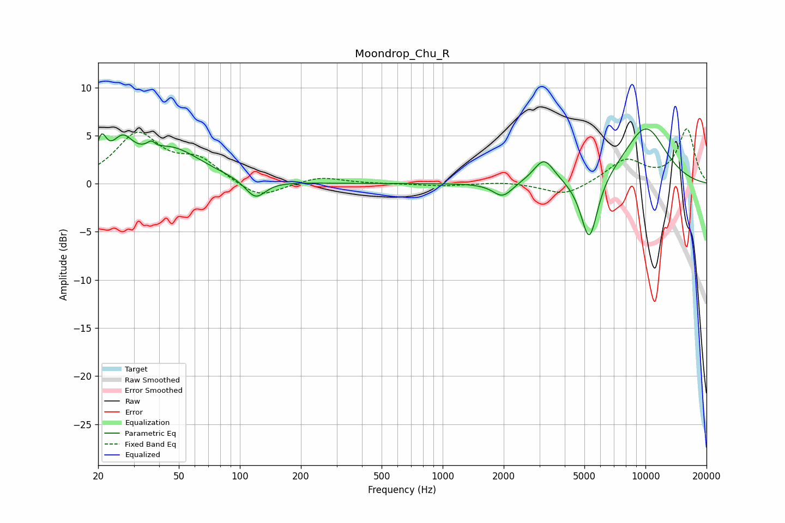

# Moondrop_Chu_R
See [usage instructions](https://github.com/jaakkopasanen/AutoEq#usage) for more options and info.

### Parametric EQs
Apply preamp of -5.8 dB when using parametric equalizer.

|   # | Type    |   Fc (Hz) |    Q |   Gain (dB) |
|-----|---------|-----------|------|-------------|
|   1 | Peaking |        21 | 5.79 |         3   |
|   2 | Peaking |        26 | 2.68 |         3.1 |
|   3 | Peaking |        37 | 5.92 |         3.2 |
|   4 | Peaking |        38 | 5.98 |        -2.6 |
|   5 | Peaking |        46 | 0.94 |         3.5 |
|   6 | Peaking |       119 | 2.86 |        -2   |
|   7 | Peaking |      1978 | 2.93 |        -1.5 |
|   8 | Peaking |      3159 | 2.75 |         2.5 |
|   9 | Peaking |      5285 | 3.25 |        -6.9 |
|  10 | Peaking |     10000 | 1.1  |         5.9 |

### Fixed Band EQs
When using fixed band (also called graphic) equalizer, apply preamp of **-5.8 dB** (if available) and set gains manually with these parameters.

|   # | Type    |   Fc (Hz) |    Q |   Gain (dB) |
|-----|---------|-----------|------|-------------|
|   1 | Peaking |        31 | 1.41 |         5   |
|   2 | Peaking |        62 | 1.41 |         2.2 |
|   3 | Peaking |       125 | 1.41 |        -1.7 |
|   4 | Peaking |       250 | 1.41 |         0.7 |
|   5 | Peaking |       500 | 1.41 |        -0   |
|   6 | Peaking |      1000 | 1.41 |        -0.2 |
|   7 | Peaking |      2000 | 1.41 |         0.2 |
|   8 | Peaking |      4000 | 1.41 |        -1.3 |
|   9 | Peaking |      8000 | 1.41 |         2.4 |
|  10 | Peaking |     16000 | 1.41 |         5.6 |

### Graphs

