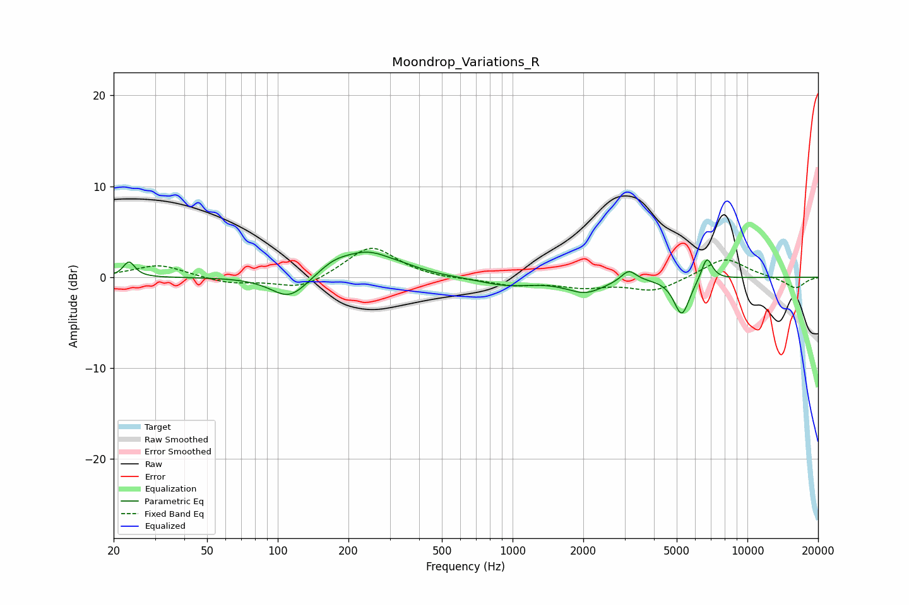

# Moondrop_Variations_R
See [usage instructions](https://github.com/jaakkopasanen/AutoEq#usage) for more options and info.

### Parametric EQs
Apply preamp of -2.9 dB when using parametric equalizer.

|   # | Type    |   Fc (Hz) |    Q |   Gain (dB) |
|-----|---------|-----------|------|-------------|
|   1 | Peaking |        23 | 5.9  |         1.7 |
|   2 | Peaking |       112 | 1.8  |        -2.6 |
|   3 | Peaking |       173 | 2.05 |         1   |
|   4 | Peaking |       242 | 1.24 |         2.6 |
|   5 | Peaking |       353 | 1.9  |         0.3 |
|   6 | Peaking |       940 | 1.21 |        -0.9 |
|   7 | Peaking |      2040 | 1.73 |        -1.6 |
|   8 | Peaking |      3123 | 4.46 |         1.3 |
|   9 | Peaking |      5255 | 4.15 |        -4.1 |
|  10 | Peaking |      6720 | 5.79 |         2.6 |

### Fixed Band EQs
When using fixed band (also called graphic) equalizer, apply preamp of **-3.3 dB** (if available) and set gains manually with these parameters.

|   # | Type    |   Fc (Hz) |    Q |   Gain (dB) |
|-----|---------|-----------|------|-------------|
|   1 | Peaking |        31 | 1.41 |         1.4 |
|   2 | Peaking |        62 | 1.41 |        -0.7 |
|   3 | Peaking |       125 | 1.41 |        -1.4 |
|   4 | Peaking |       250 | 1.41 |         3.5 |
|   5 | Peaking |       500 | 1.41 |        -0.2 |
|   6 | Peaking |      1000 | 1.41 |        -0.8 |
|   7 | Peaking |      2000 | 1.41 |        -0.9 |
|   8 | Peaking |      4000 | 1.41 |        -1.5 |
|   9 | Peaking |      8000 | 1.41 |         2.2 |
|  10 | Peaking |     16000 | 1.41 |        -1.2 |

### Graphs

