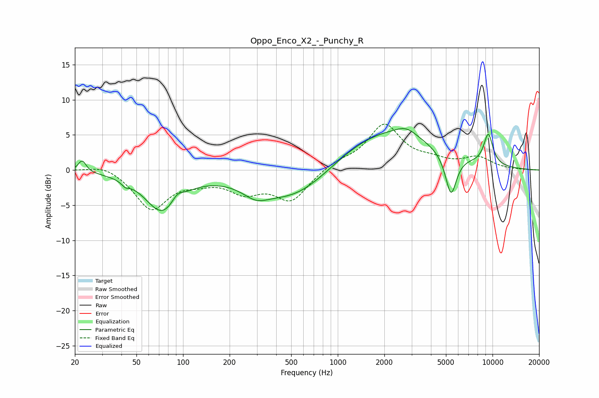

# Oppo_Enco_X2_-_Punchy_R
See [usage instructions](https://github.com/jaakkopasanen/AutoEq#usage) for more options and info.

### Parametric EQs
Apply preamp of -6.0 dB when using parametric equalizer.

|   # | Type    |   Fc (Hz) |    Q |   Gain (dB) |
|-----|---------|-----------|------|-------------|
|   1 | Peaking |        22 | 5.56 |         1.7 |
|   2 | Peaking |        42 | 5.99 |        -0.6 |
|   3 | Peaking |        74 | 1.27 |        -5.8 |
|   4 | Peaking |        92 | 3.75 |         1.3 |
|   5 | Peaking |       295 | 1.71 |        -1.6 |
|   6 | Peaking |       534 | 0.58 |        -4.9 |
|   7 | Peaking |      1939 | 0.43 |         5.9 |
|   8 | Peaking |      2777 | 2.03 |         1.2 |
|   9 | Peaking |      5390 | 3.79 |        -6   |
|  10 | Peaking |      9391 | 4.19 |         4.4 |

### Fixed Band EQs
When using fixed band (also called graphic) equalizer, apply preamp of **-6.6 dB** (if available) and set gains manually with these parameters.

|   # | Type    |   Fc (Hz) |    Q |   Gain (dB) |
|-----|---------|-----------|------|-------------|
|   1 | Peaking |        31 | 1.41 |         1   |
|   2 | Peaking |        62 | 1.41 |        -5.5 |
|   3 | Peaking |       125 | 1.41 |        -1.1 |
|   4 | Peaking |       250 | 1.41 |        -2.7 |
|   5 | Peaking |       500 | 1.41 |        -4.2 |
|   6 | Peaking |      1000 | 1.41 |         1   |
|   7 | Peaking |      2000 | 1.41 |         6.3 |
|   8 | Peaking |      4000 | 1.41 |         1   |
|   9 | Peaking |      8000 | 1.41 |         1.7 |
|  10 | Peaking |     16000 | 1.41 |         0   |

### Graphs

