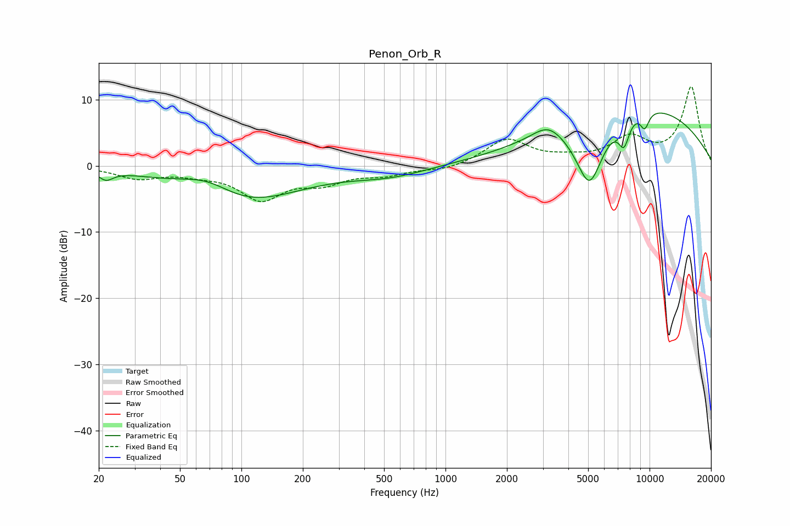

# Penon_Orb_R
See [usage instructions](https://github.com/jaakkopasanen/AutoEq#usage) for more options and info.

### Parametric EQs
Apply preamp of -8.1 dB when using parametric equalizer.

|   # | Type    |   Fc (Hz) |    Q |   Gain (dB) |
|-----|---------|-----------|------|-------------|
|   1 | Peaking |        22 | 4.21 |        -1.3 |
|   2 | Peaking |        69 | 0.99 |         3.4 |
|   3 | Peaking |        94 | 0.51 |        -6.5 |
|   4 | Peaking |       532 | 0.77 |        -1.4 |
|   5 | Peaking |      3183 | 1.92 |         2.1 |
|   6 | Peaking |      5078 | 1.83 |       -11.3 |
|   7 | Peaking |      6465 | 0.45 |         2.8 |
|   8 | Peaking |      7491 | 4.89 |        -4   |
|   9 | Peaking |      8952 | 0.28 |         7.5 |
|  10 | Peaking |      9463 | 5.82 |        -2.5 |

### Fixed Band EQs
When using fixed band (also called graphic) equalizer, apply preamp of **-12.1 dB** (if available) and set gains manually with these parameters.

|   # | Type    |   Fc (Hz) |    Q |   Gain (dB) |
|-----|---------|-----------|------|-------------|
|   1 | Peaking |        31 | 1.41 |        -1.8 |
|   2 | Peaking |        62 | 1.41 |        -0.9 |
|   3 | Peaking |       125 | 1.41 |        -4.8 |
|   4 | Peaking |       250 | 1.41 |        -2.2 |
|   5 | Peaking |       500 | 1.41 |        -1.2 |
|   6 | Peaking |      1000 | 1.41 |        -0.7 |
|   7 | Peaking |      2000 | 1.41 |         3.9 |
|   8 | Peaking |      4000 | 1.41 |         0.7 |
|   9 | Peaking |      8000 | 1.41 |         3.9 |
|  10 | Peaking |     16000 | 1.41 |        11.8 |

### Graphs

