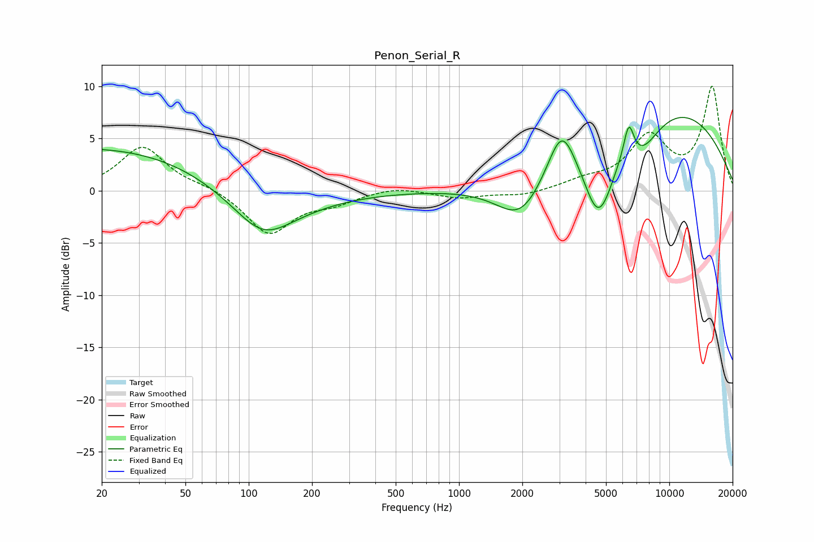

# Penon_Serial_R
See [usage instructions](https://github.com/jaakkopasanen/AutoEq#usage) for more options and info.

### Parametric EQs
Apply preamp of -7.1 dB when using parametric equalizer.

|   # | Type    |   Fc (Hz) |    Q |   Gain (dB) |
|-----|---------|-----------|------|-------------|
|   1 | Peaking |        20 | 0.23 |         4.2 |
|   2 | Peaking |       117 | 1.13 |        -2.7 |
|   3 | Peaking |       119 | 0.57 |        -2.6 |
|   4 | Peaking |      1970 | 1.23 |        -4.1 |
|   5 | Peaking |      3073 | 2.19 |         4.8 |
|   6 | Peaking |      4552 | 1.98 |        -6.3 |
|   7 | Peaking |      4953 | 2.58 |        -1   |
|   8 | Peaking |      6419 | 5.56 |         3.4 |
|   9 | Peaking |      7344 | 1.45 |        -3   |
|  10 | Peaking |      9486 | 0.32 |         8.2 |

### Fixed Band EQs
When using fixed band (also called graphic) equalizer, apply preamp of **-10.1 dB** (if available) and set gains manually with these parameters.

|   # | Type    |   Fc (Hz) |    Q |   Gain (dB) |
|-----|---------|-----------|------|-------------|
|   1 | Peaking |        31 | 1.41 |         4.2 |
|   2 | Peaking |        62 | 1.41 |         0.4 |
|   3 | Peaking |       125 | 1.41 |        -4.1 |
|   4 | Peaking |       250 | 1.41 |        -1   |
|   5 | Peaking |       500 | 1.41 |         0.4 |
|   6 | Peaking |      1000 | 1.41 |        -0.7 |
|   7 | Peaking |      2000 | 1.41 |        -0.5 |
|   8 | Peaking |      4000 | 1.41 |         0.8 |
|   9 | Peaking |      8000 | 1.41 |         4.9 |
|  10 | Peaking |     16000 | 1.41 |         9.8 |

### Graphs

