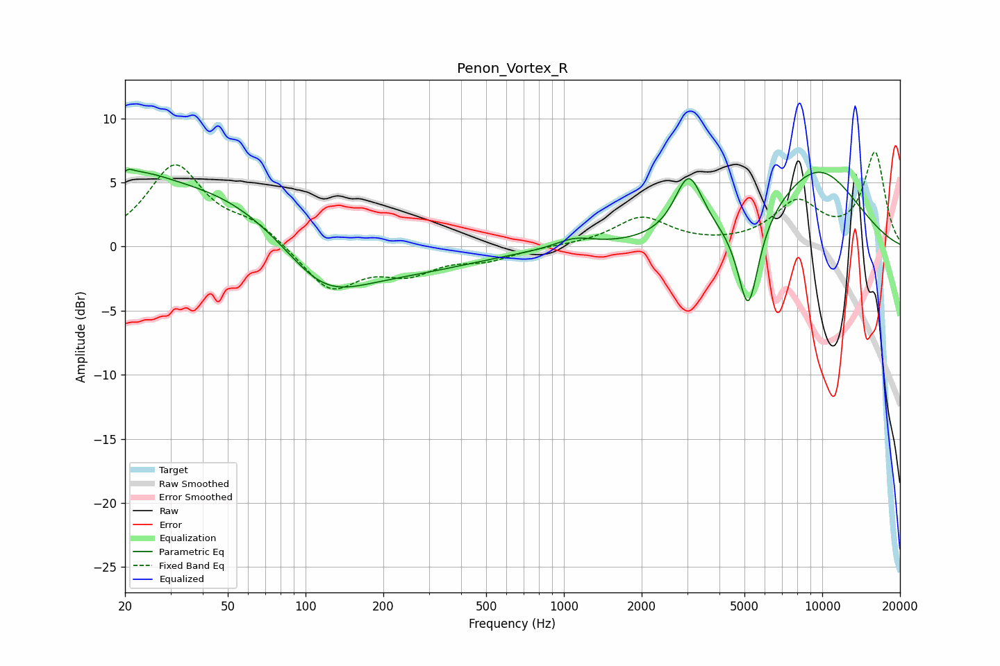

# Penon_Vortex_R
See [usage instructions](https://github.com/jaakkopasanen/AutoEq#usage) for more options and info.

### Parametric EQs
Apply preamp of -6.1 dB when using parametric equalizer.

|   # | Type    |   Fc (Hz) |    Q |   Gain (dB) |
|-----|---------|-----------|------|-------------|
|   1 | Peaking |        21 | 5.5  |         3.1 |
|   2 | Peaking |        21 | 6    |        -2.2 |
|   3 | Peaking |        23 | 1.41 |         1.3 |
|   4 | Peaking |        38 | 0.33 |         5   |
|   5 | Peaking |       116 | 0.85 |        -4.3 |
|   6 | Peaking |       230 | 0.48 |        -1.8 |
|   7 | Peaking |      1100 | 1.9  |         0.7 |
|   8 | Peaking |      3043 | 2.58 |         4.8 |
|   9 | Peaking |      5169 | 3.36 |        -7.4 |
|  10 | Peaking |      9543 | 0.69 |         6   |

### Fixed Band EQs
When using fixed band (also called graphic) equalizer, apply preamp of **-7.5 dB** (if available) and set gains manually with these parameters.

|   # | Type    |   Fc (Hz) |    Q |   Gain (dB) |
|-----|---------|-----------|------|-------------|
|   1 | Peaking |        31 | 1.41 |         6.2 |
|   2 | Peaking |        62 | 1.41 |         1.6 |
|   3 | Peaking |       125 | 1.41 |        -3.4 |
|   4 | Peaking |       250 | 1.41 |        -1.8 |
|   5 | Peaking |       500 | 1.41 |        -0.9 |
|   6 | Peaking |      1000 | 1.41 |         0   |
|   7 | Peaking |      2000 | 1.41 |         2.2 |
|   8 | Peaking |      4000 | 1.41 |        -0   |
|   9 | Peaking |      8000 | 1.41 |         3.2 |
|  10 | Peaking |     16000 | 1.41 |         7.2 |

### Graphs

