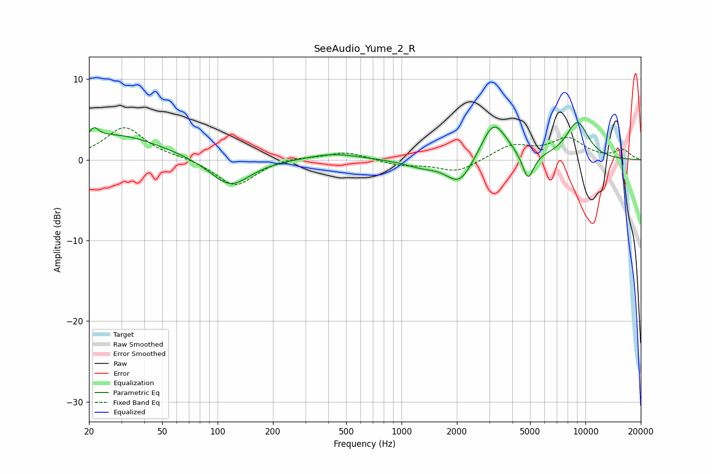

# SeeAudio_Yume_2_R
See [usage instructions](https://github.com/jaakkopasanen/AutoEq#usage) for more options and info.

### Parametric EQs
Apply preamp of -4.7 dB when using parametric equalizer.

|   # | Type    |   Fc (Hz) |    Q |   Gain (dB) |
|-----|---------|-----------|------|-------------|
|   1 | Peaking |        21 | 5.89 |         1.2 |
|   2 | Peaking |        28 | 0.57 |         3.1 |
|   3 | Peaking |       117 | 1.3  |        -3.5 |
|   4 | Peaking |       427 | 0.99 |         0.8 |
|   5 | Peaking |      1283 | 1.5  |        -0.8 |
|   6 | Peaking |      2067 | 1.97 |        -3.2 |
|   7 | Peaking |      3156 | 2.14 |         3.9 |
|   8 | Peaking |      3302 | 1.72 |         1.1 |
|   9 | Peaking |      4877 | 4.52 |        -3.4 |
|  10 | Peaking |      9037 | 2.02 |         4.6 |

### Fixed Band EQs
When using fixed band (also called graphic) equalizer, apply preamp of **-4.1 dB** (if available) and set gains manually with these parameters.

|   # | Type    |   Fc (Hz) |    Q |   Gain (dB) |
|-----|---------|-----------|------|-------------|
|   1 | Peaking |        31 | 1.41 |         4   |
|   2 | Peaking |        62 | 1.41 |         0.2 |
|   3 | Peaking |       125 | 1.41 |        -3.4 |
|   4 | Peaking |       250 | 1.41 |         0.4 |
|   5 | Peaking |       500 | 1.41 |         1   |
|   6 | Peaking |      1000 | 1.41 |        -0.7 |
|   7 | Peaking |      2000 | 1.41 |        -1.5 |
|   8 | Peaking |      4000 | 1.41 |         1.8 |
|   9 | Peaking |      8000 | 1.41 |         2.5 |
|  10 | Peaking |     16000 | 1.41 |         1.2 |

### Graphs

