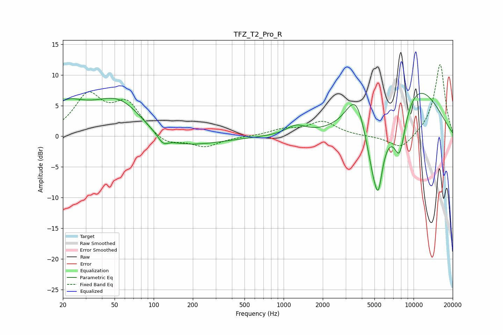

# TFZ_T2_Pro_R
See [usage instructions](https://github.com/jaakkopasanen/AutoEq#usage) for more options and info.

### Parametric EQs
Apply preamp of -7.1 dB when using parametric equalizer.

|   # | Type    |   Fc (Hz) |    Q |   Gain (dB) |
|-----|---------|-----------|------|-------------|
|   1 | Peaking |        21 | 1.03 |         3.9 |
|   2 | Peaking |        56 | 0.63 |         8   |
|   3 | Peaking |       109 | 0.45 |        -3.9 |
|   4 | Peaking |       118 | 3.7  |        -1.3 |
|   5 | Peaking |      1248 | 1.89 |         1.5 |
|   6 | Peaking |      3627 | 1.72 |         7.1 |
|   7 | Peaking |      5012 | 1.8  |       -11.4 |
|   8 | Peaking |      5365 | 5.2  |        -4.3 |
|   9 | Peaking |      7808 | 2.68 |        -8.1 |
|  10 | Peaking |     10000 | 0.51 |         8.8 |

### Fixed Band EQs
When using fixed band (also called graphic) equalizer, apply preamp of **-11.8 dB** (if available) and set gains manually with these parameters.

|   # | Type    |   Fc (Hz) |    Q |   Gain (dB) |
|-----|---------|-----------|------|-------------|
|   1 | Peaking |        31 | 1.41 |         6.3 |
|   2 | Peaking |        62 | 1.41 |         5   |
|   3 | Peaking |       125 | 1.41 |        -1.6 |
|   4 | Peaking |       250 | 1.41 |        -1.7 |
|   5 | Peaking |       500 | 1.41 |        -0   |
|   6 | Peaking |      1000 | 1.41 |         1   |
|   7 | Peaking |      2000 | 1.41 |         2.3 |
|   8 | Peaking |      4000 | 1.41 |        -0   |
|   9 | Peaking |      8000 | 1.41 |        -2.3 |
|  10 | Peaking |     16000 | 1.41 |        11.9 |

### Graphs

