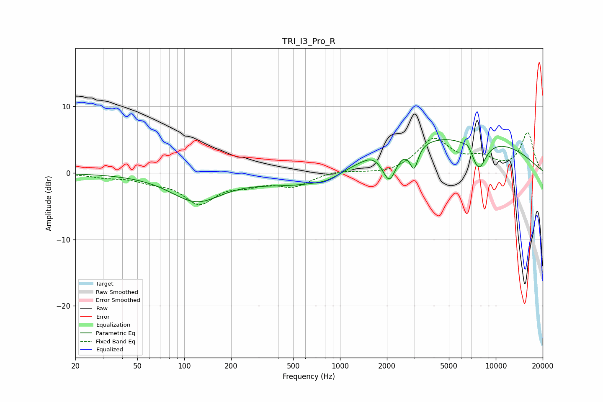

# TRI_I3_Pro_R
See [usage instructions](https://github.com/jaakkopasanen/AutoEq#usage) for more options and info.

### Parametric EQs
Apply preamp of -5.1 dB when using parametric equalizer.

|   # | Type    |   Fc (Hz) |    Q |   Gain (dB) |
|-----|---------|-----------|------|-------------|
|   1 | Peaking |       119 | 0.86 |        -4.1 |
|   2 | Peaking |       591 | 0.52 |        -2.1 |
|   3 | Peaking |       827 | 1.75 |        -0.2 |
|   4 | Peaking |       840 | 1.48 |        -0.6 |
|   5 | Peaking |      1596 | 2.55 |         0.5 |
|   6 | Peaking |      2074 | 3.2  |        -4.6 |
|   7 | Peaking |      2987 | 5.36 |        -3.5 |
|   8 | Peaking |      5285 | 0.23 |         5.8 |
|   9 | Peaking |      6628 | 6    |         0.7 |
|  10 | Peaking |      7774 | 2.71 |        -4.6 |

### Fixed Band EQs
When using fixed band (also called graphic) equalizer, apply preamp of **-6.2 dB** (if available) and set gains manually with these parameters.

|   # | Type    |   Fc (Hz) |    Q |   Gain (dB) |
|-----|---------|-----------|------|-------------|
|   1 | Peaking |        31 | 1.41 |        -0.5 |
|   2 | Peaking |        62 | 1.41 |        -0.9 |
|   3 | Peaking |       125 | 1.41 |        -4.3 |
|   4 | Peaking |       250 | 1.41 |        -1.3 |
|   5 | Peaking |       500 | 1.41 |        -1.9 |
|   6 | Peaking |      1000 | 1.41 |         0.4 |
|   7 | Peaking |      2000 | 1.41 |        -0.3 |
|   8 | Peaking |      4000 | 1.41 |         4.9 |
|   9 | Peaking |      8000 | 1.41 |         1.9 |
|  10 | Peaking |     16000 | 1.41 |         6   |

### Graphs

