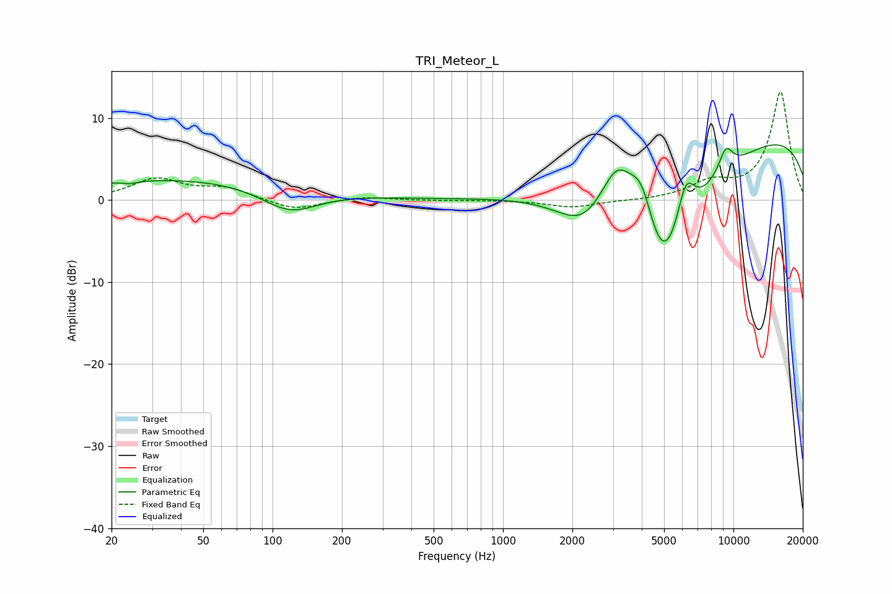

# TRI_Meteor_L
See [usage instructions](https://github.com/jaakkopasanen/AutoEq#usage) for more options and info.

### Parametric EQs
Apply preamp of -6.8 dB when using parametric equalizer.

|   # | Type    |   Fc (Hz) |    Q |   Gain (dB) |
|-----|---------|-----------|------|-------------|
|   1 | Peaking |        24 | 4.77 |        -0.3 |
|   2 | Peaking |        45 | 0.26 |         2.7 |
|   3 | Peaking |       119 | 1.11 |        -3.1 |
|   4 | Peaking |      2269 | 1.21 |        -4.3 |
|   5 | Peaking |      3134 | 1.68 |         7.6 |
|   6 | Peaking |      4003 | 2.7  |         5.2 |
|   7 | Peaking |      4968 | 0.88 |       -17.8 |
|   8 | Peaking |      6214 | 3.36 |         5.8 |
|   9 | Peaking |      9261 | 3.85 |         3   |
|  10 | Peaking |     10000 | 0.18 |         9   |

### Fixed Band EQs
When using fixed band (also called graphic) equalizer, apply preamp of **-13.3 dB** (if available) and set gains manually with these parameters.

|   # | Type    |   Fc (Hz) |    Q |   Gain (dB) |
|-----|---------|-----------|------|-------------|
|   1 | Peaking |        31 | 1.41 |         2.5 |
|   2 | Peaking |        62 | 1.41 |         1.4 |
|   3 | Peaking |       125 | 1.41 |        -1.3 |
|   4 | Peaking |       250 | 1.41 |         0.4 |
|   5 | Peaking |       500 | 1.41 |        -0.1 |
|   6 | Peaking |      1000 | 1.41 |         0   |
|   7 | Peaking |      2000 | 1.41 |        -0.9 |
|   8 | Peaking |      4000 | 1.41 |        -0.1 |
|   9 | Peaking |      8000 | 1.41 |         1.9 |
|  10 | Peaking |     16000 | 1.41 |        13.2 |

### Graphs

