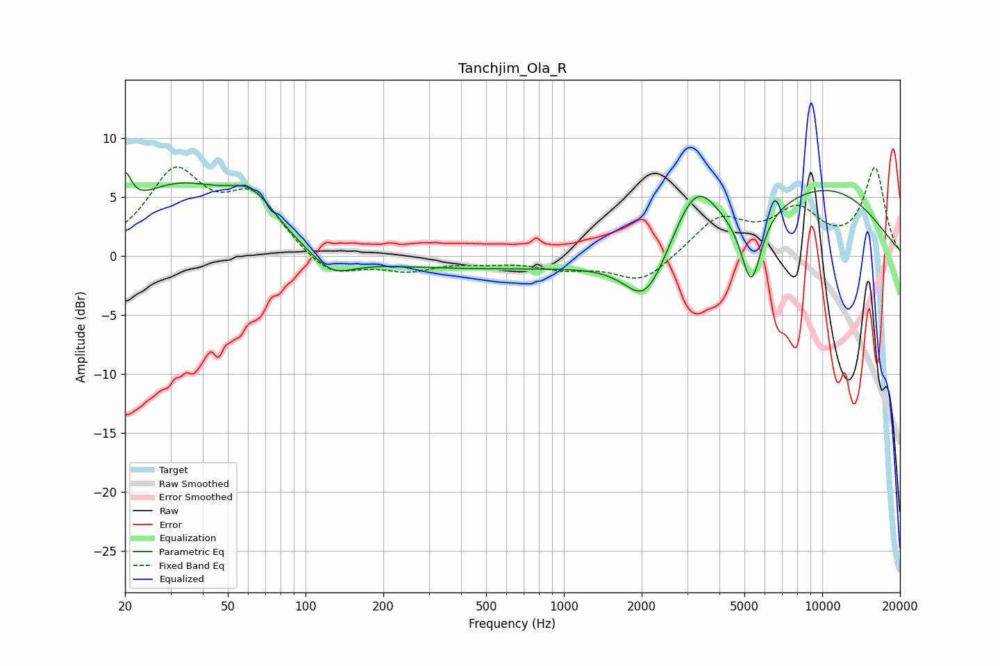

# Tanchjim_Ola_R
See [usage instructions](https://github.com/jaakkopasanen/AutoEq#usage) for more options and info.

### Parametric EQs
Apply preamp of -7.1 dB when using parametric equalizer.

|   # | Type    |   Fc (Hz) |    Q |   Gain (dB) |
|-----|---------|-----------|------|-------------|
|   1 | Peaking |        20 | 5.99 |         3   |
|   2 | Peaking |        32 | 0.68 |         5.6 |
|   3 | Peaking |        62 | 1.46 |         3.2 |
|   4 | Peaking |       127 | 1.74 |        -1.8 |
|   5 | Peaking |       573 | 0.19 |        -1.1 |
|   6 | Peaking |      2068 | 1.76 |        -4.2 |
|   7 | Peaking |      3083 | 1.81 |         1   |
|   8 | Peaking |      3277 | 1.63 |         4.2 |
|   9 | Peaking |      5310 | 3.54 |        -6.1 |
|  10 | Peaking |     10000 | 0.44 |         5.7 |

### Fixed Band EQs
When using fixed band (also called graphic) equalizer, apply preamp of **-7.6 dB** (if available) and set gains manually with these parameters.

|   # | Type    |   Fc (Hz) |    Q |   Gain (dB) |
|-----|---------|-----------|------|-------------|
|   1 | Peaking |        31 | 1.41 |         6.7 |
|   2 | Peaking |        62 | 1.41 |         4.7 |
|   3 | Peaking |       125 | 1.41 |        -2   |
|   4 | Peaking |       250 | 1.41 |        -1.1 |
|   5 | Peaking |       500 | 1.41 |        -0.4 |
|   6 | Peaking |      1000 | 1.41 |        -0.9 |
|   7 | Peaking |      2000 | 1.41 |        -2.3 |
|   8 | Peaking |      4000 | 1.41 |         3.1 |
|   9 | Peaking |      8000 | 1.41 |         3.5 |
|  10 | Peaking |     16000 | 1.41 |         7.3 |

### Graphs

