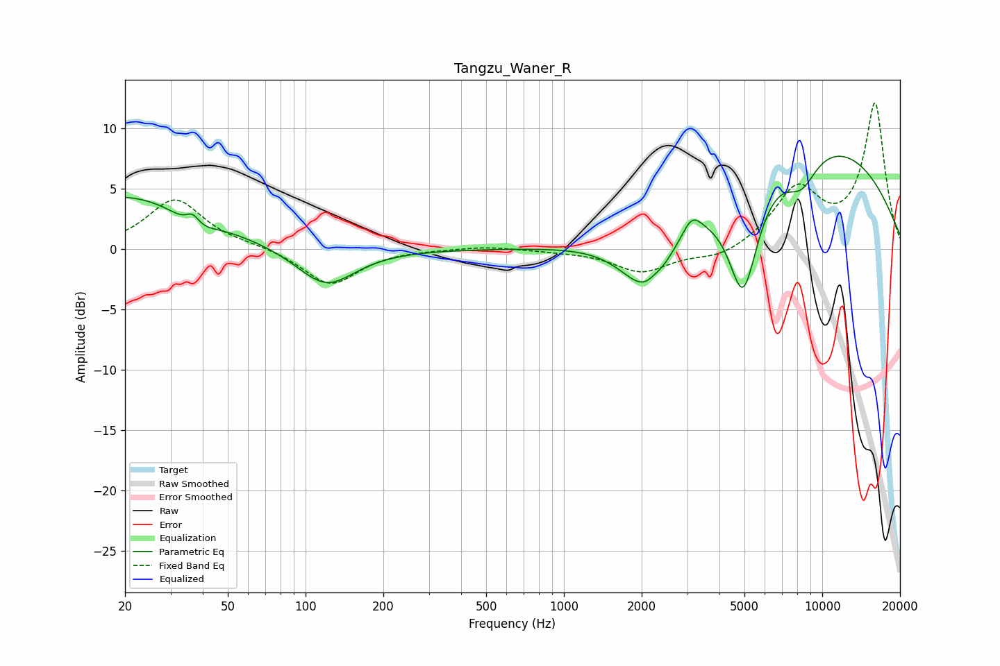

# Tangzu_Waner_R
See [usage instructions](https://github.com/jaakkopasanen/AutoEq#usage) for more options and info.

### Parametric EQs
Apply preamp of -7.8 dB when using parametric equalizer.

|   # | Type    |   Fc (Hz) |    Q |   Gain (dB) |
|-----|---------|-----------|------|-------------|
|   1 | Peaking |        20 | 0.48 |         4.4 |
|   2 | Peaking |        37 | 4.94 |         1.4 |
|   3 | Peaking |        37 | 2.39 |        -1.5 |
|   4 | Peaking |       120 | 1.25 |        -3.3 |
|   5 | Peaking |      2104 | 1.39 |        -5.2 |
|   6 | Peaking |      2236 | 5.68 |         0.3 |
|   7 | Peaking |      3125 | 3.71 |         1.7 |
|   8 | Peaking |      4939 | 2.35 |        -9.2 |
|   9 | Peaking |      8292 | 2.07 |        -2.8 |
|  10 | Peaking |      9319 | 0.31 |         9   |

### Fixed Band EQs
When using fixed band (also called graphic) equalizer, apply preamp of **-12.2 dB** (if available) and set gains manually with these parameters.

|   # | Type    |   Fc (Hz) |    Q |   Gain (dB) |
|-----|---------|-----------|------|-------------|
|   1 | Peaking |        31 | 1.41 |         4.1 |
|   2 | Peaking |        62 | 1.41 |         0.2 |
|   3 | Peaking |       125 | 1.41 |        -3   |
|   4 | Peaking |       250 | 1.41 |         0   |
|   5 | Peaking |       500 | 1.41 |         0.3 |
|   6 | Peaking |      1000 | 1.41 |        -0.1 |
|   7 | Peaking |      2000 | 1.41 |        -1.9 |
|   8 | Peaking |      4000 | 1.41 |        -0.9 |
|   9 | Peaking |      8000 | 1.41 |         4.8 |
|  10 | Peaking |     16000 | 1.41 |        11.9 |

### Graphs

