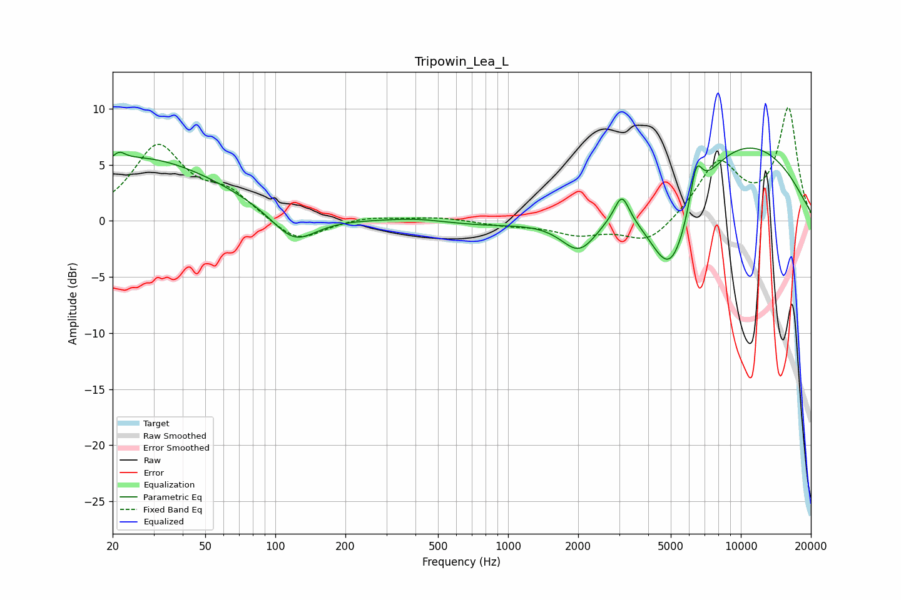

# Tripowin_Lea_L
See [usage instructions](https://github.com/jaakkopasanen/AutoEq#usage) for more options and info.

### Parametric EQs
Apply preamp of -6.6 dB when using parametric equalizer.

|   # | Type    |   Fc (Hz) |    Q |   Gain (dB) |
|-----|---------|-----------|------|-------------|
|   1 | Peaking |        21 | 5.99 |         0.6 |
|   2 | Peaking |        26 | 0.39 |         5.6 |
|   3 | Peaking |       120 | 1.46 |        -2.8 |
|   4 | Peaking |       408 | 1.1  |         0.4 |
|   5 | Peaking |      1034 | 0.45 |        -0.7 |
|   6 | Peaking |      2031 | 1.7  |        -3.5 |
|   7 | Peaking |      3082 | 4.51 |         2.4 |
|   8 | Peaking |      4998 | 1.26 |       -10.5 |
|   9 | Peaking |      6425 | 5.07 |         3.6 |
|  10 | Peaking |      8334 | 0.32 |         8.3 |

### Fixed Band EQs
When using fixed band (also called graphic) equalizer, apply preamp of **-10.2 dB** (if available) and set gains manually with these parameters.

|   # | Type    |   Fc (Hz) |    Q |   Gain (dB) |
|-----|---------|-----------|------|-------------|
|   1 | Peaking |        31 | 1.41 |         6.5 |
|   2 | Peaking |        62 | 1.41 |         2.2 |
|   3 | Peaking |       125 | 1.41 |        -2.1 |
|   4 | Peaking |       250 | 1.41 |         0.4 |
|   5 | Peaking |       500 | 1.41 |         0.3 |
|   6 | Peaking |      1000 | 1.41 |        -0.4 |
|   7 | Peaking |      2000 | 1.41 |        -1.1 |
|   8 | Peaking |      4000 | 1.41 |        -2.1 |
|   9 | Peaking |      8000 | 1.41 |         5.1 |
|  10 | Peaking |     16000 | 1.41 |         9.9 |

### Graphs

