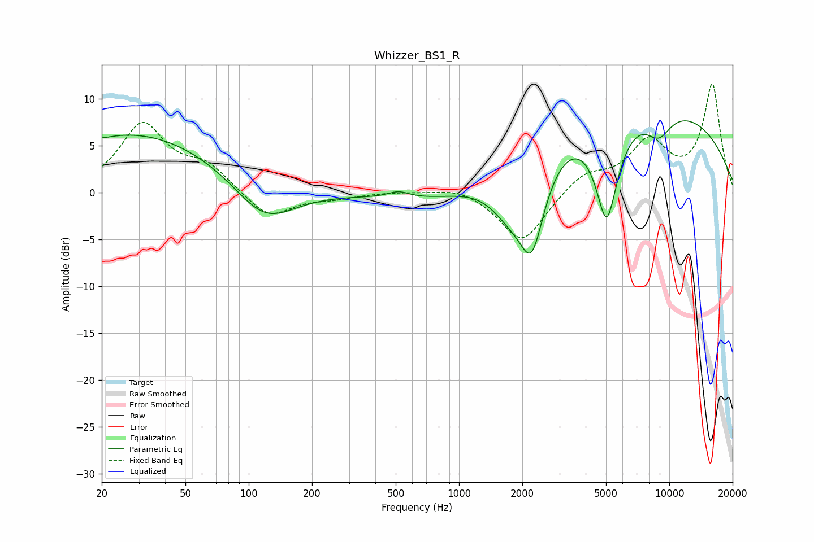

# Whizzer_BS1_R
See [usage instructions](https://github.com/jaakkopasanen/AutoEq#usage) for more options and info.

### Parametric EQs
Apply preamp of -7.7 dB when using parametric equalizer.

|   # | Type    |   Fc (Hz) |    Q |   Gain (dB) |
|-----|---------|-----------|------|-------------|
|   1 | Peaking |        22 | 5.83 |        -0.1 |
|   2 | Peaking |        29 | 0.33 |         6.4 |
|   3 | Peaking |       119 | 0.96 |        -4.5 |
|   4 | Peaking |       516 | 2.83 |         0.7 |
|   5 | Peaking |       917 | 0.53 |        -2.4 |
|   6 | Peaking |      1759 | 1.33 |        -4.7 |
|   7 | Peaking |      2221 | 2.23 |        -9.1 |
|   8 | Peaking |      5040 | 2.49 |       -11.3 |
|   9 | Peaking |      6237 | 0.2  |        10.2 |
|  10 | Peaking |      8910 | 2.06 |        -2.8 |

### Fixed Band EQs
When using fixed band (also called graphic) equalizer, apply preamp of **-11.7 dB** (if available) and set gains manually with these parameters.

|   # | Type    |   Fc (Hz) |    Q |   Gain (dB) |
|-----|---------|-----------|------|-------------|
|   1 | Peaking |        31 | 1.41 |         7.1 |
|   2 | Peaking |        62 | 1.41 |         2.6 |
|   3 | Peaking |       125 | 1.41 |        -2.8 |
|   4 | Peaking |       250 | 1.41 |        -0.5 |
|   5 | Peaking |       500 | 1.41 |         0.1 |
|   6 | Peaking |      1000 | 1.41 |         0.7 |
|   7 | Peaking |      2000 | 1.41 |        -5.5 |
|   8 | Peaking |      4000 | 1.41 |         2   |
|   9 | Peaking |      8000 | 1.41 |         5.1 |
|  10 | Peaking |     16000 | 1.41 |        11.4 |

### Graphs

