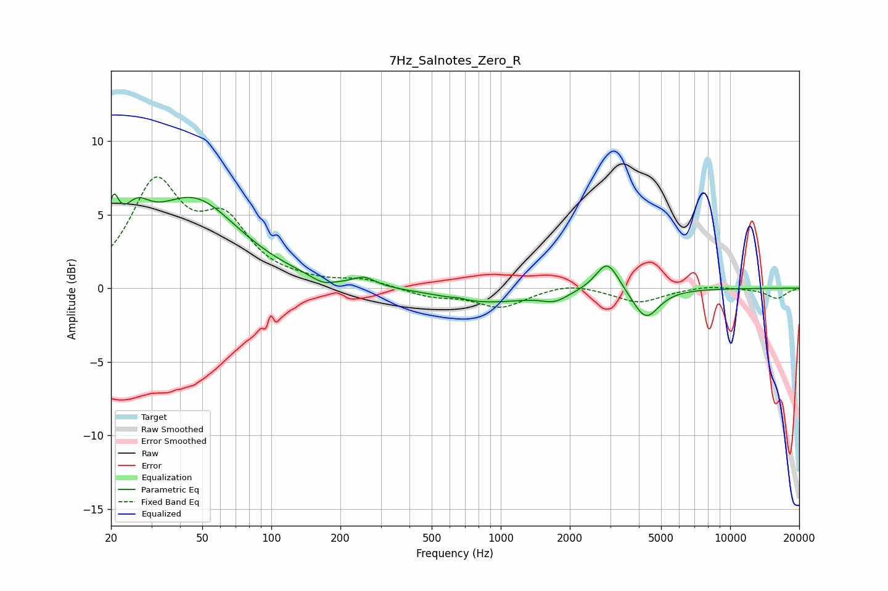

# 7Hz_Salnotes_Zero_R
See [usage instructions](https://github.com/jaakkopasanen/AutoEq#usage) for more options and info.

### Parametric EQs
Apply preamp of -6.5 dB when using parametric equalizer.

|   # | Type    |   Fc (Hz) |    Q |   Gain (dB) |
|-----|---------|-----------|------|-------------|
|   1 | Peaking |        20 | 5.98 |         2.9 |
|   2 | Peaking |        26 | 2.29 |         2.4 |
|   3 | Peaking |        46 | 0.71 |         5.9 |
|   4 | Peaking |       168 | 2.73 |        -0.5 |
|   5 | Peaking |       255 | 3.09 |         0.6 |
|   6 | Peaking |       654 | 5.99 |         0.1 |
|   7 | Peaking |       868 | 0.74 |        -0.9 |
|   8 | Peaking |      1719 | 2.46 |        -0.6 |
|   9 | Peaking |      2916 | 2.77 |         2.1 |
|  10 | Peaking |      4287 | 2.46 |        -2.1 |

### Fixed Band EQs
When using fixed band (also called graphic) equalizer, apply preamp of **-7.7 dB** (if available) and set gains manually with these parameters.

|   # | Type    |   Fc (Hz) |    Q |   Gain (dB) |
|-----|---------|-----------|------|-------------|
|   1 | Peaking |        31 | 1.41 |         6.8 |
|   2 | Peaking |        62 | 1.41 |         4   |
|   3 | Peaking |       125 | 1.41 |         0.2 |
|   4 | Peaking |       250 | 1.41 |         0.5 |
|   5 | Peaking |       500 | 1.41 |        -0.5 |
|   6 | Peaking |      1000 | 1.41 |        -1.3 |
|   7 | Peaking |      2000 | 1.41 |         0.4 |
|   8 | Peaking |      4000 | 1.41 |        -1   |
|   9 | Peaking |      8000 | 1.41 |         0.2 |
|  10 | Peaking |     16000 | 1.41 |        -0.7 |

### Graphs

