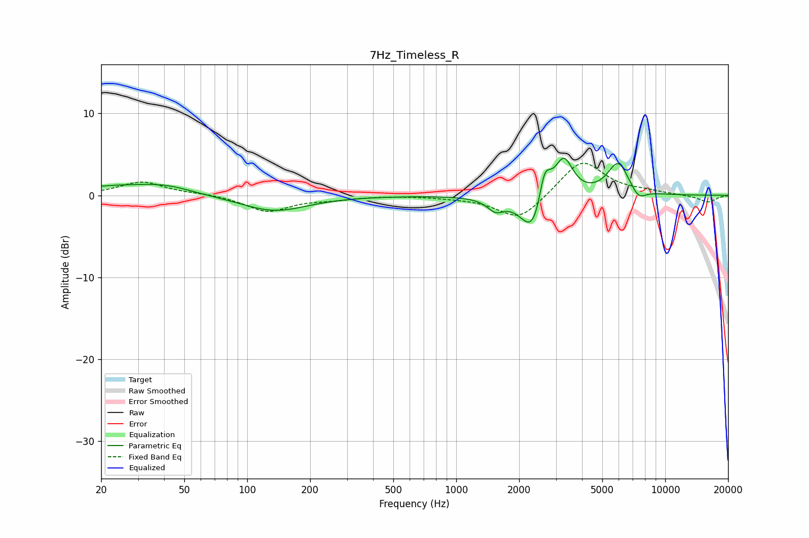

# 7Hz_Timeless_R
See [usage instructions](https://github.com/jaakkopasanen/AutoEq#usage) for more options and info.

### Parametric EQs
Apply preamp of -4.6 dB when using parametric equalizer.

|   # | Type    |   Fc (Hz) |    Q |   Gain (dB) |
|-----|---------|-----------|------|-------------|
|   1 | Peaking |        23 | 0.68 |         1   |
|   2 | Peaking |        41 | 1.14 |         0.8 |
|   3 | Peaking |       135 | 0.89 |        -1.9 |
|   4 | Peaking |      1543 | 3.53 |        -1.4 |
|   5 | Peaking |      2346 | 2.42 |        -5.3 |
|   6 | Peaking |      2636 | 5.45 |         3.5 |
|   7 | Peaking |      2750 | 3.67 |         1.4 |
|   8 | Peaking |      3272 | 3.2  |         4.7 |
|   9 | Peaking |      5958 | 2.72 |         4   |
|  10 | Peaking |      7447 | 3.9  |        -1.3 |

### Fixed Band EQs
When using fixed band (also called graphic) equalizer, apply preamp of **-4.0 dB** (if available) and set gains manually with these parameters.

|   # | Type    |   Fc (Hz) |    Q |   Gain (dB) |
|-----|---------|-----------|------|-------------|
|   1 | Peaking |        31 | 1.41 |         1.7 |
|   2 | Peaking |        62 | 1.41 |         0.2 |
|   3 | Peaking |       125 | 1.41 |        -2   |
|   4 | Peaking |       250 | 1.41 |        -0.4 |
|   5 | Peaking |       500 | 1.41 |         0   |
|   6 | Peaking |      1000 | 1.41 |        -0.2 |
|   7 | Peaking |      2000 | 1.41 |        -3.1 |
|   8 | Peaking |      4000 | 1.41 |         4.4 |
|   9 | Peaking |      8000 | 1.41 |         0.4 |
|  10 | Peaking |     16000 | 1.41 |        -0.8 |

### Graphs

