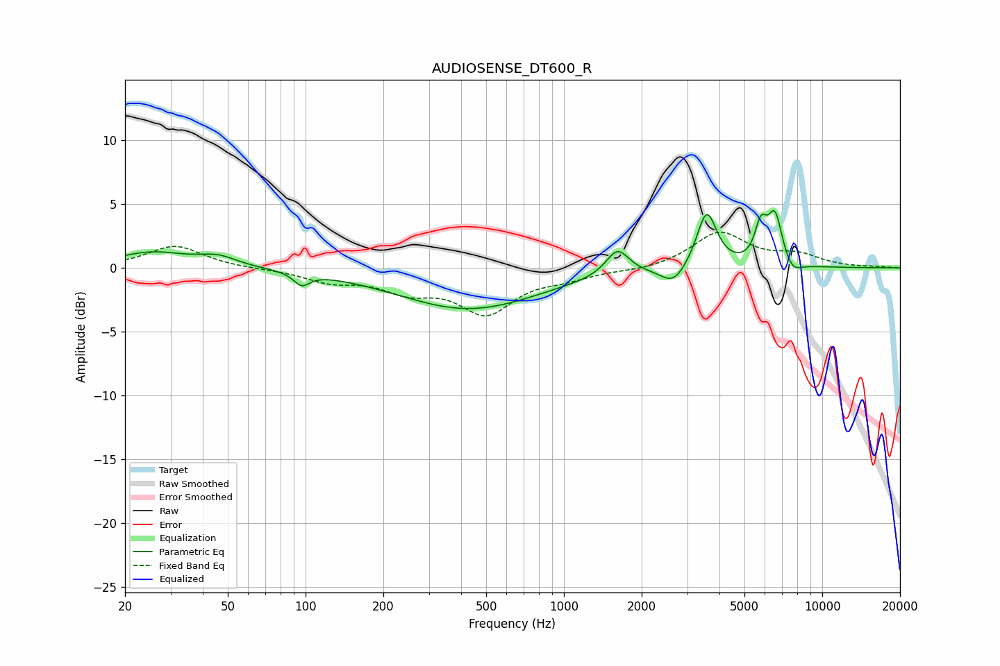

# AUDIOSENSE_DT600_R
See [usage instructions](https://github.com/jaakkopasanen/AutoEq#usage) for more options and info.

### Parametric EQs
Apply preamp of -4.6 dB when using parametric equalizer.

|   # | Type    |   Fc (Hz) |    Q |   Gain (dB) |
|-----|---------|-----------|------|-------------|
|   1 | Peaking |        25 | 1.03 |         1.2 |
|   2 | Peaking |        46 | 1.95 |         0.7 |
|   3 | Peaking |        97 | 4.66 |        -1   |
|   4 | Peaking |       428 | 0.52 |        -3.2 |
|   5 | Peaking |      1612 | 3.2  |         2   |
|   6 | Peaking |      2654 | 2.88 |        -1.4 |
|   7 | Peaking |      3571 | 3.66 |         4.5 |
|   8 | Peaking |      5785 | 6    |         2.7 |
|   9 | Peaking |      6563 | 4.74 |         4   |
|  10 | Peaking |      7653 | 3.89 |        -0.9 |

### Fixed Band EQs
When using fixed band (also called graphic) equalizer, apply preamp of **-2.9 dB** (if available) and set gains manually with these parameters.

|   # | Type    |   Fc (Hz) |    Q |   Gain (dB) |
|-----|---------|-----------|------|-------------|
|   1 | Peaking |        31 | 1.41 |         1.7 |
|   2 | Peaking |        62 | 1.41 |        -0.1 |
|   3 | Peaking |       125 | 1.41 |        -1   |
|   4 | Peaking |       250 | 1.41 |        -1.5 |
|   5 | Peaking |       500 | 1.41 |        -3.3 |
|   6 | Peaking |      1000 | 1.41 |        -0.6 |
|   7 | Peaking |      2000 | 1.41 |        -0.2 |
|   8 | Peaking |      4000 | 1.41 |         2.7 |
|   9 | Peaking |      8000 | 1.41 |         0.9 |
|  10 | Peaking |     16000 | 1.41 |         0.1 |

### Graphs

