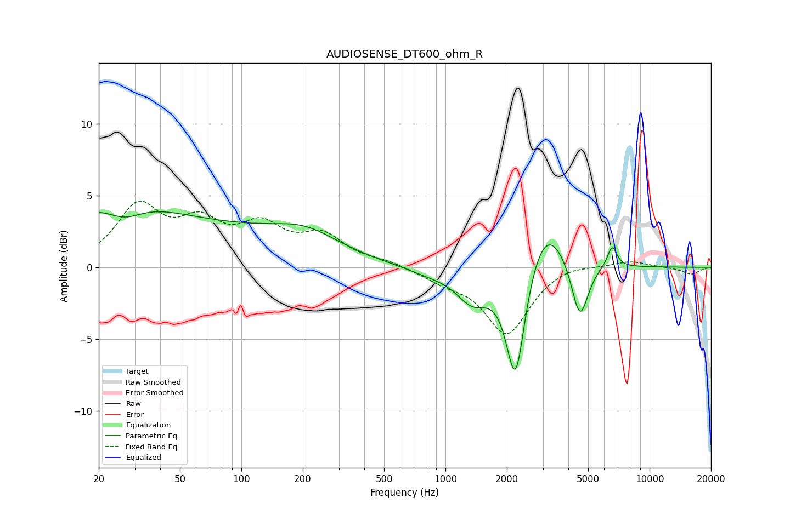

# AUDIOSENSE_DT600_ohm_R
See [usage instructions](https://github.com/jaakkopasanen/AutoEq#usage) for more options and info.

### Parametric EQs
Apply preamp of -4.0 dB when using parametric equalizer.

|   # | Type    |   Fc (Hz) |    Q |   Gain (dB) |
|-----|---------|-----------|------|-------------|
|   1 | Peaking |        24 | 0.64 |         2.6 |
|   2 | Peaking |        26 | 1.44 |        -1.6 |
|   3 | Peaking |        47 | 0.23 |         2.7 |
|   4 | Peaking |       208 | 0.86 |         1.4 |
|   5 | Peaking |       829 | 1.18 |        -0.4 |
|   6 | Peaking |      1362 | 1.72 |        -2.2 |
|   7 | Peaking |      2203 | 2.97 |        -8.3 |
|   8 | Peaking |      3081 | 1.43 |         3.7 |
|   9 | Peaking |      4554 | 3.39 |        -4.2 |
|  10 | Peaking |      6557 | 5.85 |         1.5 |

### Fixed Band EQs
When using fixed band (also called graphic) equalizer, apply preamp of **-4.7 dB** (if available) and set gains manually with these parameters.

|   # | Type    |   Fc (Hz) |    Q |   Gain (dB) |
|-----|---------|-----------|------|-------------|
|   1 | Peaking |        31 | 1.41 |         4   |
|   2 | Peaking |        62 | 1.41 |         2.6 |
|   3 | Peaking |       125 | 1.41 |         2.5 |
|   4 | Peaking |       250 | 1.41 |         2   |
|   5 | Peaking |       500 | 1.41 |         0.3 |
|   6 | Peaking |      1000 | 1.41 |        -0.8 |
|   7 | Peaking |      2000 | 1.41 |        -4.6 |
|   8 | Peaking |      4000 | 1.41 |         0.4 |
|   9 | Peaking |      8000 | 1.41 |         0.5 |
|  10 | Peaking |     16000 | 1.41 |        -0.5 |

### Graphs

