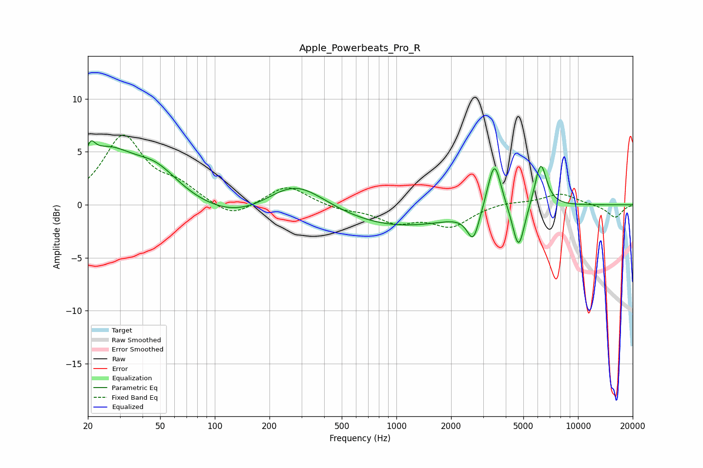

# Apple_Powerbeats_Pro_R
See [usage instructions](https://github.com/jaakkopasanen/AutoEq#usage) for more options and info.

### Parametric EQs
Apply preamp of -6.1 dB when using parametric equalizer.

|   # | Type    |   Fc (Hz) |    Q |   Gain (dB) |
|-----|---------|-----------|------|-------------|
|   1 | Peaking |        21 | 5.93 |         1.5 |
|   2 | Peaking |        25 | 0.91 |         4.6 |
|   3 | Peaking |        48 | 1.1  |         2.5 |
|   4 | Peaking |       133 | 0.67 |        -1.6 |
|   5 | Peaking |       277 | 0.88 |         2.9 |
|   6 | Peaking |       999 | 0.43 |        -2.1 |
|   7 | Peaking |      2649 | 4.27 |        -2.8 |
|   8 | Peaking |      3462 | 3.75 |         4.9 |
|   9 | Peaking |      4708 | 4.23 |        -4.3 |
|  10 | Peaking |      6228 | 4.15 |         4.3 |

### Fixed Band EQs
When using fixed band (also called graphic) equalizer, apply preamp of **-6.7 dB** (if available) and set gains manually with these parameters.

|   # | Type    |   Fc (Hz) |    Q |   Gain (dB) |
|-----|---------|-----------|------|-------------|
|   1 | Peaking |        31 | 1.41 |         6.3 |
|   2 | Peaking |        62 | 1.41 |         1.5 |
|   3 | Peaking |       125 | 1.41 |        -1.4 |
|   4 | Peaking |       250 | 1.41 |         1.9 |
|   5 | Peaking |       500 | 1.41 |        -0.4 |
|   6 | Peaking |      1000 | 1.41 |        -1.5 |
|   7 | Peaking |      2000 | 1.41 |        -1.9 |
|   8 | Peaking |      4000 | 1.41 |         0.3 |
|   9 | Peaking |      8000 | 1.41 |         1.1 |
|  10 | Peaking |     16000 | 1.41 |        -1.2 |

### Graphs

