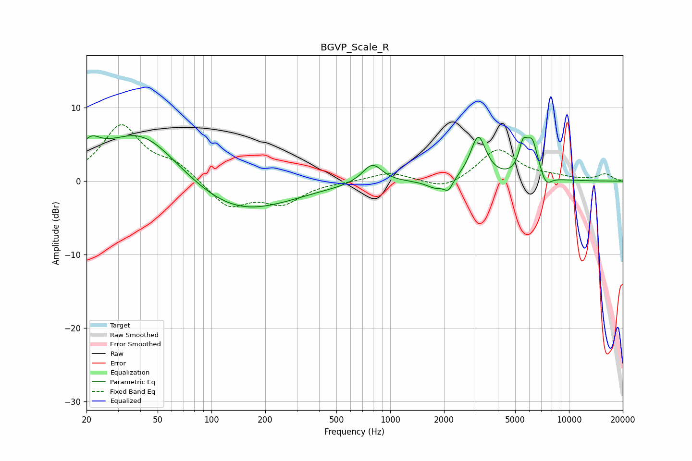

# BGVP_Scale_R
See [usage instructions](https://github.com/jaakkopasanen/AutoEq#usage) for more options and info.

### Parametric EQs
Apply preamp of -6.3 dB when using parametric equalizer.

|   # | Type    |   Fc (Hz) |    Q |   Gain (dB) |
|-----|---------|-----------|------|-------------|
|   1 | Peaking |        21 | 2.55 |         2.6 |
|   2 | Peaking |        41 | 0.64 |         7.4 |
|   3 | Peaking |       135 | 0.48 |        -4.9 |
|   4 | Peaking |       794 | 2.56 |         2.7 |
|   5 | Peaking |      1803 | 2.65 |        -1.1 |
|   6 | Peaking |      2117 | 5.89 |        -1.4 |
|   7 | Peaking |      3106 | 3.22 |         6   |
|   8 | Peaking |      5525 | 5.96 |         3.2 |
|   9 | Peaking |      6225 | 3.85 |         5   |
|  10 | Peaking |      7420 | 4.28 |        -1.7 |

### Fixed Band EQs
When using fixed band (also called graphic) equalizer, apply preamp of **-7.8 dB** (if available) and set gains manually with these parameters.

|   # | Type    |   Fc (Hz) |    Q |   Gain (dB) |
|-----|---------|-----------|------|-------------|
|   1 | Peaking |        31 | 1.41 |         7.5 |
|   2 | Peaking |        62 | 1.41 |         2.1 |
|   3 | Peaking |       125 | 1.41 |        -3.6 |
|   4 | Peaking |       250 | 1.41 |        -2.8 |
|   5 | Peaking |       500 | 1.41 |        -0.1 |
|   6 | Peaking |      1000 | 1.41 |         1.2 |
|   7 | Peaking |      2000 | 1.41 |        -1.3 |
|   8 | Peaking |      4000 | 1.41 |         4.4 |
|   9 | Peaking |      8000 | 1.41 |         0.5 |
|  10 | Peaking |     16000 | 1.41 |         0.9 |

### Graphs

