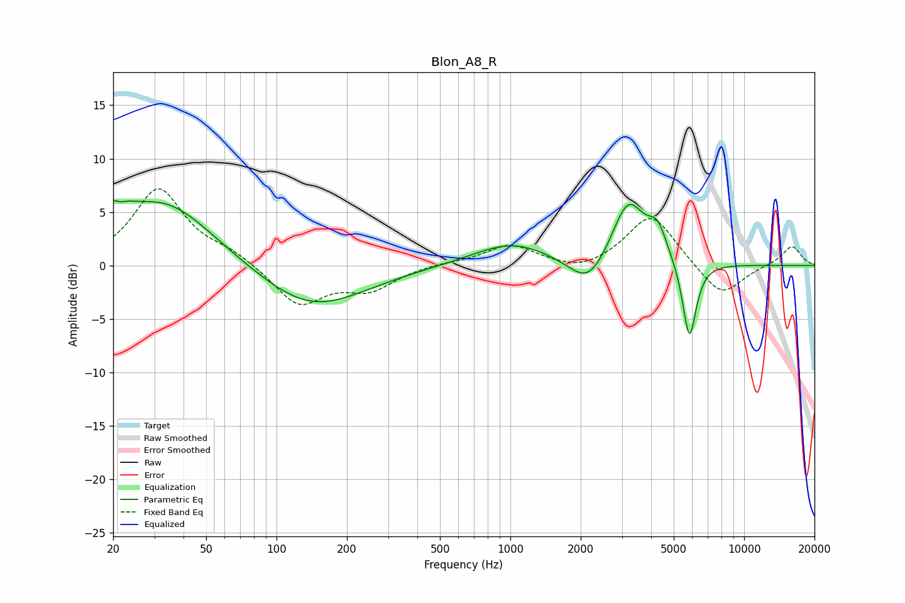

# Blon_A8_R
See [usage instructions](https://github.com/jaakkopasanen/AutoEq#usage) for more options and info.

### Parametric EQs
Apply preamp of -6.2 dB when using parametric equalizer.

|   # | Type    |   Fc (Hz) |    Q |   Gain (dB) |
|-----|---------|-----------|------|-------------|
|   1 | Peaking |        20 | 5.92 |         3.2 |
|   2 | Peaking |        21 | 5.99 |        -2.4 |
|   3 | Peaking |        21 | 2.14 |         1.5 |
|   4 | Peaking |        33 | 0.67 |         6   |
|   5 | Peaking |       141 | 0.62 |        -4.2 |
|   6 | Peaking |      1012 | 0.85 |         2.2 |
|   7 | Peaking |      2162 | 1.71 |        -3   |
|   8 | Peaking |      3190 | 1.96 |         6.1 |
|   9 | Peaking |      4263 | 3.48 |         2.6 |
|  10 | Peaking |      5835 | 4.7  |        -7.5 |

### Fixed Band EQs
When using fixed band (also called graphic) equalizer, apply preamp of **-7.3 dB** (if available) and set gains manually with these parameters.

|   # | Type    |   Fc (Hz) |    Q |   Gain (dB) |
|-----|---------|-----------|------|-------------|
|   1 | Peaking |        31 | 1.41 |         7.1 |
|   2 | Peaking |        62 | 1.41 |         1   |
|   3 | Peaking |       125 | 1.41 |        -3.7 |
|   4 | Peaking |       250 | 1.41 |        -2.1 |
|   5 | Peaking |       500 | 1.41 |         0.2 |
|   6 | Peaking |      1000 | 1.41 |         1.9 |
|   7 | Peaking |      2000 | 1.41 |        -0.8 |
|   8 | Peaking |      4000 | 1.41 |         4.9 |
|   9 | Peaking |      8000 | 1.41 |        -3.1 |
|  10 | Peaking |     16000 | 1.41 |         1.9 |

### Graphs

