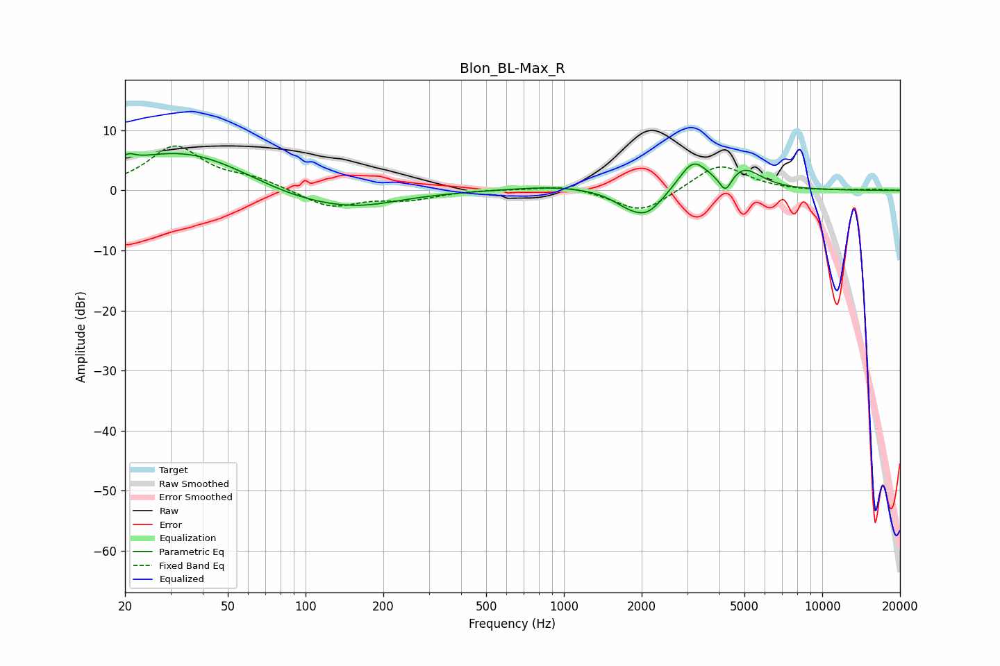

# Blon_BL-Max_R
See [usage instructions](https://github.com/jaakkopasanen/AutoEq#usage) for more options and info.

### Parametric EQs
Apply preamp of -6.2 dB when using parametric equalizer.

|   # | Type    |   Fc (Hz) |    Q |   Gain (dB) |
|-----|---------|-----------|------|-------------|
|   1 | Peaking |        21 | 5.32 |         1.1 |
|   2 | Peaking |        35 | 0.51 |         7.1 |
|   3 | Peaking |        96 | 0.59 |        -3.3 |
|   4 | Peaking |       165 | 0.93 |        -1.4 |
|   5 | Peaking |       916 | 0.86 |         0.8 |
|   6 | Peaking |      1754 | 2.31 |        -1.4 |
|   7 | Peaking |      2101 | 2.14 |        -3.9 |
|   8 | Peaking |      3164 | 2.54 |         4.9 |
|   9 | Peaking |      4227 | 5.79 |        -3.1 |
|  10 | Peaking |      4960 | 2.03 |         3.4 |

### Fixed Band EQs
When using fixed band (also called graphic) equalizer, apply preamp of **-7.5 dB** (if available) and set gains manually with these parameters.

|   # | Type    |   Fc (Hz) |    Q |   Gain (dB) |
|-----|---------|-----------|------|-------------|
|   1 | Peaking |        31 | 1.41 |         7.2 |
|   2 | Peaking |        62 | 1.41 |         1.6 |
|   3 | Peaking |       125 | 1.41 |        -2.9 |
|   4 | Peaking |       250 | 1.41 |        -1.4 |
|   5 | Peaking |       500 | 1.41 |         0.2 |
|   6 | Peaking |      1000 | 1.41 |         1   |
|   7 | Peaking |      2000 | 1.41 |        -3.9 |
|   8 | Peaking |      4000 | 1.41 |         4.6 |
|   9 | Peaking |      8000 | 1.41 |        -0.1 |
|  10 | Peaking |     16000 | 1.41 |         0.2 |

### Graphs

