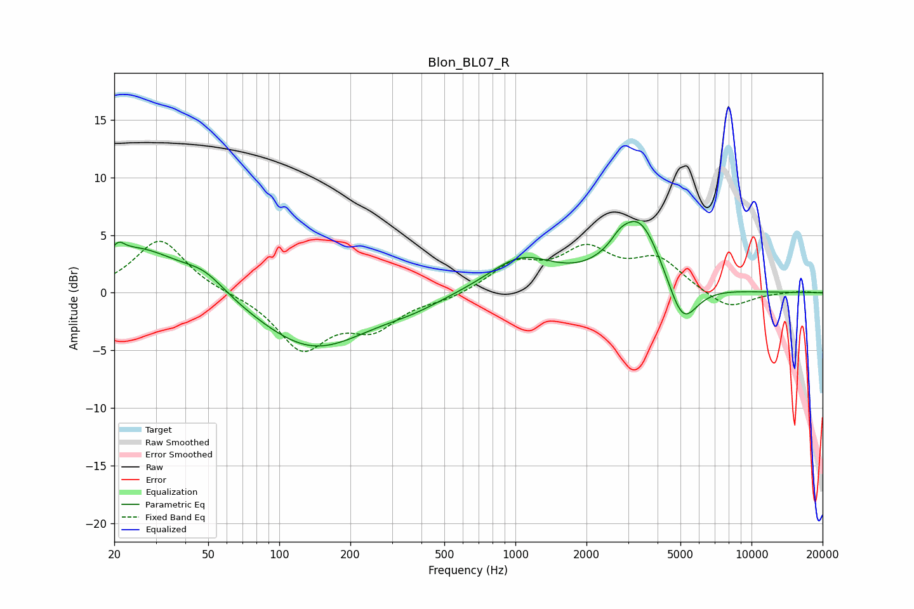

# Blon_BL07_R
See [usage instructions](https://github.com/jaakkopasanen/AutoEq#usage) for more options and info.

### Parametric EQs
Apply preamp of -6.3 dB when using parametric equalizer.

|   # | Type    |   Fc (Hz) |    Q |   Gain (dB) |
|-----|---------|-----------|------|-------------|
|   1 | Peaking |        21 | 5.94 |         3.2 |
|   2 | Peaking |        21 | 5.84 |        -2.4 |
|   3 | Peaking |        25 | 0.7  |         4   |
|   4 | Peaking |        48 | 1.6  |         1.3 |
|   5 | Peaking |       139 | 0.6  |        -4.9 |
|   6 | Peaking |       370 | 1.12 |        -0.6 |
|   7 | Peaking |      1055 | 1    |         2.9 |
|   8 | Peaking |      2760 | 4.37 |         0.5 |
|   9 | Peaking |      3327 | 1.37 |         6.5 |
|  10 | Peaking |      5098 | 2.16 |        -4.3 |

### Fixed Band EQs
When using fixed band (also called graphic) equalizer, apply preamp of **-4.6 dB** (if available) and set gains manually with these parameters.

|   # | Type    |   Fc (Hz) |    Q |   Gain (dB) |
|-----|---------|-----------|------|-------------|
|   1 | Peaking |        31 | 1.41 |         4.7 |
|   2 | Peaking |        62 | 1.41 |        -0   |
|   3 | Peaking |       125 | 1.41 |        -4.7 |
|   4 | Peaking |       250 | 1.41 |        -2.7 |
|   5 | Peaking |       500 | 1.41 |        -0.5 |
|   6 | Peaking |      1000 | 1.41 |         2.4 |
|   7 | Peaking |      2000 | 1.41 |         3.4 |
|   8 | Peaking |      4000 | 1.41 |         2.7 |
|   9 | Peaking |      8000 | 1.41 |        -1.5 |
|  10 | Peaking |     16000 | 1.41 |         0.1 |

### Graphs

