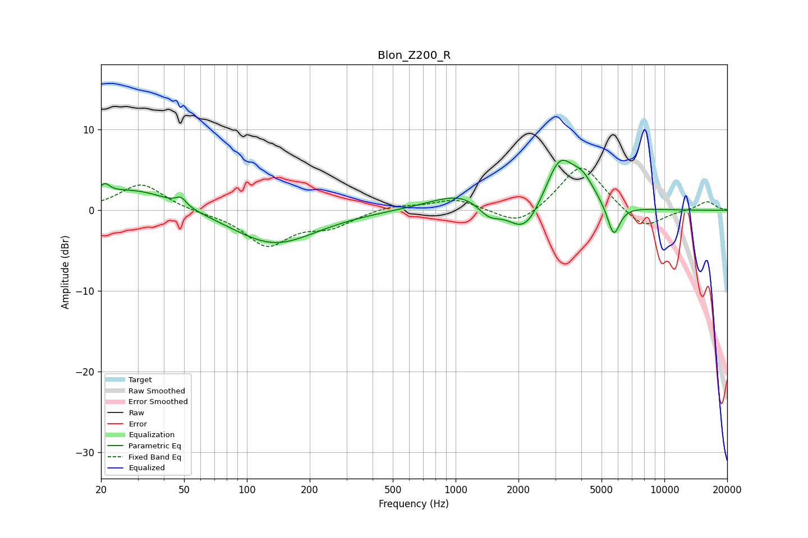

# Blon_Z200_R
See [usage instructions](https://github.com/jaakkopasanen/AutoEq#usage) for more options and info.

### Parametric EQs
Apply preamp of -6.3 dB when using parametric equalizer.

|   # | Type    |   Fc (Hz) |    Q |   Gain (dB) |
|-----|---------|-----------|------|-------------|
|   1 | Peaking |        21 | 5.73 |         1.3 |
|   2 | Peaking |        29 | 0.71 |         2.8 |
|   3 | Peaking |        48 | 5.87 |         1   |
|   4 | Peaking |       135 | 0.7  |        -4.3 |
|   5 | Peaking |      1113 | 0.91 |         2.4 |
|   6 | Peaking |      1440 | 2.44 |        -1.9 |
|   7 | Peaking |      2147 | 1.77 |        -4   |
|   8 | Peaking |      3144 | 1.98 |         6.3 |
|   9 | Peaking |      4075 | 2.46 |         2.6 |
|  10 | Peaking |      5718 | 4.62 |        -4   |

### Fixed Band EQs
When using fixed band (also called graphic) equalizer, apply preamp of **-5.3 dB** (if available) and set gains manually with these parameters.

|   # | Type    |   Fc (Hz) |    Q |   Gain (dB) |
|-----|---------|-----------|------|-------------|
|   1 | Peaking |        31 | 1.41 |         3.3 |
|   2 | Peaking |        62 | 1.41 |        -0.2 |
|   3 | Peaking |       125 | 1.41 |        -4.3 |
|   4 | Peaking |       250 | 1.41 |        -1.8 |
|   5 | Peaking |       500 | 1.41 |         0.7 |
|   6 | Peaking |      1000 | 1.41 |         1.4 |
|   7 | Peaking |      2000 | 1.41 |        -2.2 |
|   8 | Peaking |      4000 | 1.41 |         5.9 |
|   9 | Peaking |      8000 | 1.41 |        -2.5 |
|  10 | Peaking |     16000 | 1.41 |         1.1 |

### Graphs

