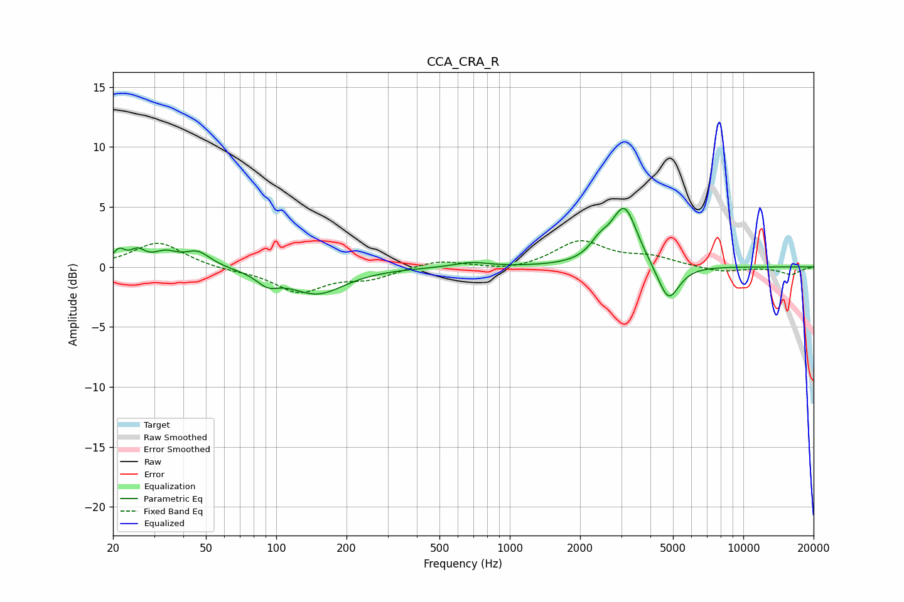

# CCA_CRA_R
See [usage instructions](https://github.com/jaakkopasanen/AutoEq#usage) for more options and info.

### Parametric EQs
Apply preamp of -5.0 dB when using parametric equalizer.

|   # | Type    |   Fc (Hz) |    Q |   Gain (dB) |
|-----|---------|-----------|------|-------------|
|   1 | Peaking |        21 | 5.58 |         1.1 |
|   2 | Peaking |        25 | 4.36 |         1   |
|   3 | Peaking |        34 | 2.7  |         1   |
|   4 | Peaking |        46 | 2.57 |         1.2 |
|   5 | Peaking |        92 | 3.05 |        -1   |
|   6 | Peaking |       149 | 1.19 |        -2.2 |
|   7 | Peaking |       682 | 1.97 |         0.4 |
|   8 | Peaking |      2427 | 3.29 |         1.2 |
|   9 | Peaking |      3101 | 2.57 |         4.9 |
|  10 | Peaking |      4780 | 3.02 |        -3.2 |

### Fixed Band EQs
When using fixed band (also called graphic) equalizer, apply preamp of **-2.3 dB** (if available) and set gains manually with these parameters.

|   # | Type    |   Fc (Hz) |    Q |   Gain (dB) |
|-----|---------|-----------|------|-------------|
|   1 | Peaking |        31 | 1.41 |         2.1 |
|   2 | Peaking |        62 | 1.41 |        -0.2 |
|   3 | Peaking |       125 | 1.41 |        -2   |
|   4 | Peaking |       250 | 1.41 |        -0.9 |
|   5 | Peaking |       500 | 1.41 |         0.6 |
|   6 | Peaking |      1000 | 1.41 |        -0.4 |
|   7 | Peaking |      2000 | 1.41 |         2.1 |
|   8 | Peaking |      4000 | 1.41 |         0.7 |
|   9 | Peaking |      8000 | 1.41 |        -0.4 |
|  10 | Peaking |     16000 | 1.41 |        -0.6 |

### Graphs

