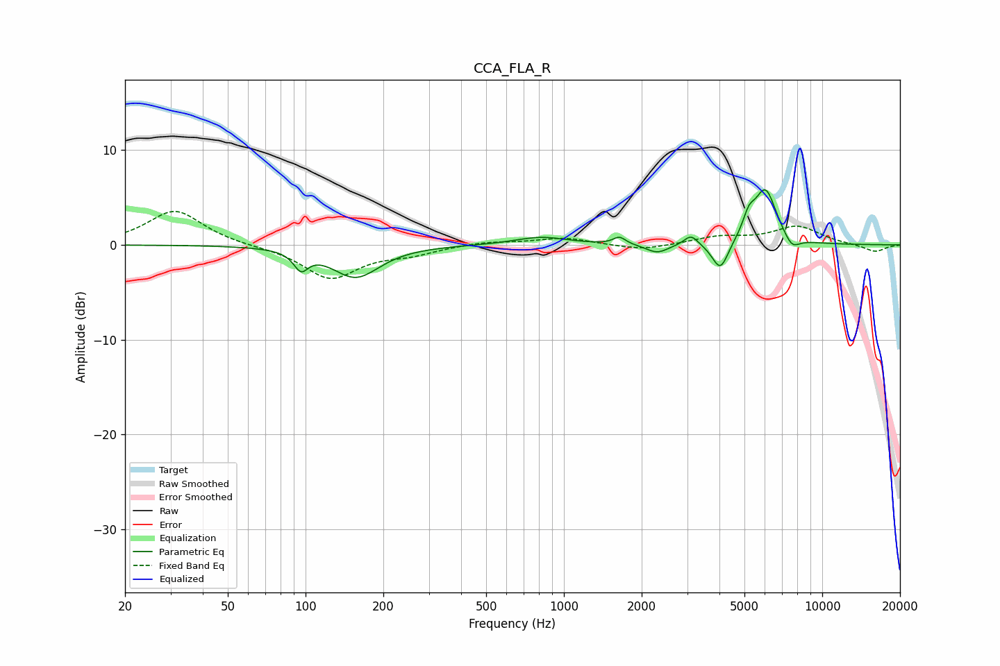

# CCA_FLA_R
See [usage instructions](https://github.com/jaakkopasanen/AutoEq#usage) for more options and info.

### Parametric EQs
Apply preamp of -5.9 dB when using parametric equalizer.

|   # | Type    |   Fc (Hz) |    Q |   Gain (dB) |
|-----|---------|-----------|------|-------------|
|   1 | Peaking |        96 | 5.17 |        -1.9 |
|   2 | Peaking |       156 | 1.53 |        -3.4 |
|   3 | Peaking |       816 | 1.4  |         0.8 |
|   4 | Peaking |      1641 | 6    |         0.8 |
|   5 | Peaking |      2298 | 3.3  |        -0.9 |
|   6 | Peaking |      3106 | 5.26 |         1.1 |
|   7 | Peaking |      4034 | 4.45 |        -3.1 |
|   8 | Peaking |      5199 | 5.87 |         1.9 |
|   9 | Peaking |      6026 | 3.13 |         5.8 |
|  10 | Peaking |      7627 | 4.37 |        -1.3 |

### Fixed Band EQs
When using fixed band (also called graphic) equalizer, apply preamp of **-3.6 dB** (if available) and set gains manually with these parameters.

|   # | Type    |   Fc (Hz) |    Q |   Gain (dB) |
|-----|---------|-----------|------|-------------|
|   1 | Peaking |        31 | 1.41 |         3.7 |
|   2 | Peaking |        62 | 1.41 |        -0.1 |
|   3 | Peaking |       125 | 1.41 |        -3.5 |
|   4 | Peaking |       250 | 1.41 |        -0.8 |
|   5 | Peaking |       500 | 1.41 |         0.4 |
|   6 | Peaking |      1000 | 1.41 |         0.7 |
|   7 | Peaking |      2000 | 1.41 |        -0.6 |
|   8 | Peaking |      4000 | 1.41 |         0.8 |
|   9 | Peaking |      8000 | 1.41 |         1.9 |
|  10 | Peaking |     16000 | 1.41 |        -0.8 |

### Graphs

