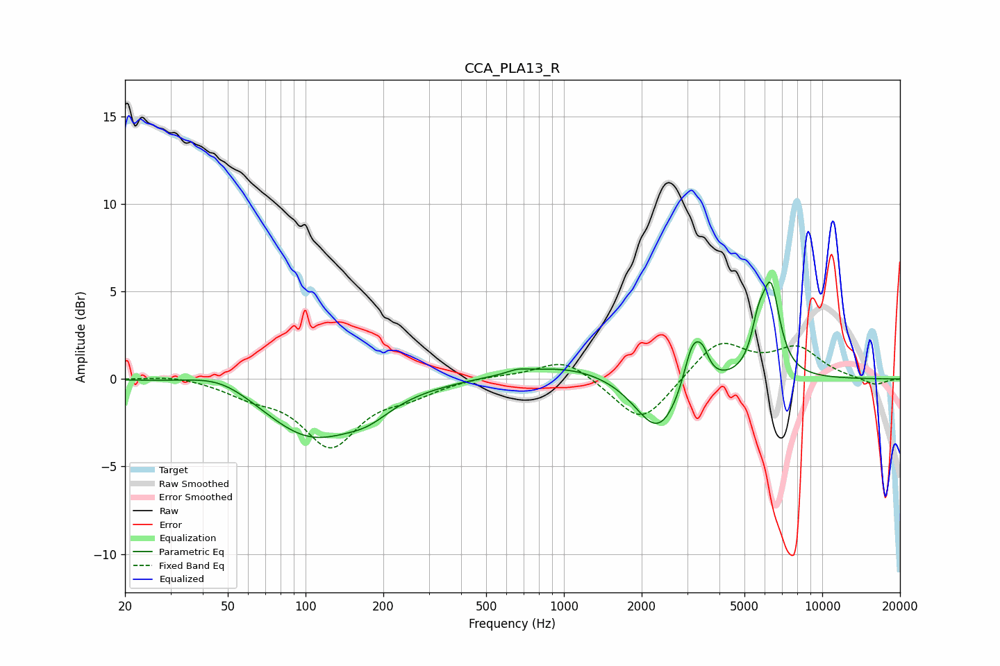

# CCA_PLA13_R
See [usage instructions](https://github.com/jaakkopasanen/AutoEq#usage) for more options and info.

### Parametric EQs
Apply preamp of -5.6 dB when using parametric equalizer.

|   # | Type    |   Fc (Hz) |    Q |   Gain (dB) |
|-----|---------|-----------|------|-------------|
|   1 | Peaking |        47 | 1.11 |         0.9 |
|   2 | Peaking |       105 | 0.75 |        -3.3 |
|   3 | Peaking |       175 | 1.59 |        -0.8 |
|   4 | Peaking |       660 | 3.69 |         0.2 |
|   5 | Peaking |      1025 | 0.68 |         0.9 |
|   6 | Peaking |      2319 | 1.59 |        -3.3 |
|   7 | Peaking |      3148 | 4.06 |         2.7 |
|   8 | Peaking |      3448 | 5.84 |         1.1 |
|   9 | Peaking |      5653 | 5.3  |         1.9 |
|  10 | Peaking |      6327 | 3.96 |         4.9 |

### Fixed Band EQs
When using fixed band (also called graphic) equalizer, apply preamp of **-2.1 dB** (if available) and set gains manually with these parameters.

|   # | Type    |   Fc (Hz) |    Q |   Gain (dB) |
|-----|---------|-----------|------|-------------|
|   1 | Peaking |        31 | 1.41 |         0.3 |
|   2 | Peaking |        62 | 1.41 |        -0.7 |
|   3 | Peaking |       125 | 1.41 |        -3.7 |
|   4 | Peaking |       250 | 1.41 |        -0.7 |
|   5 | Peaking |       500 | 1.41 |         0.2 |
|   6 | Peaking |      1000 | 1.41 |         1.2 |
|   7 | Peaking |      2000 | 1.41 |        -2.7 |
|   8 | Peaking |      4000 | 1.41 |         2.2 |
|   9 | Peaking |      8000 | 1.41 |         1.7 |
|  10 | Peaking |     16000 | 1.41 |        -0.4 |

### Graphs

