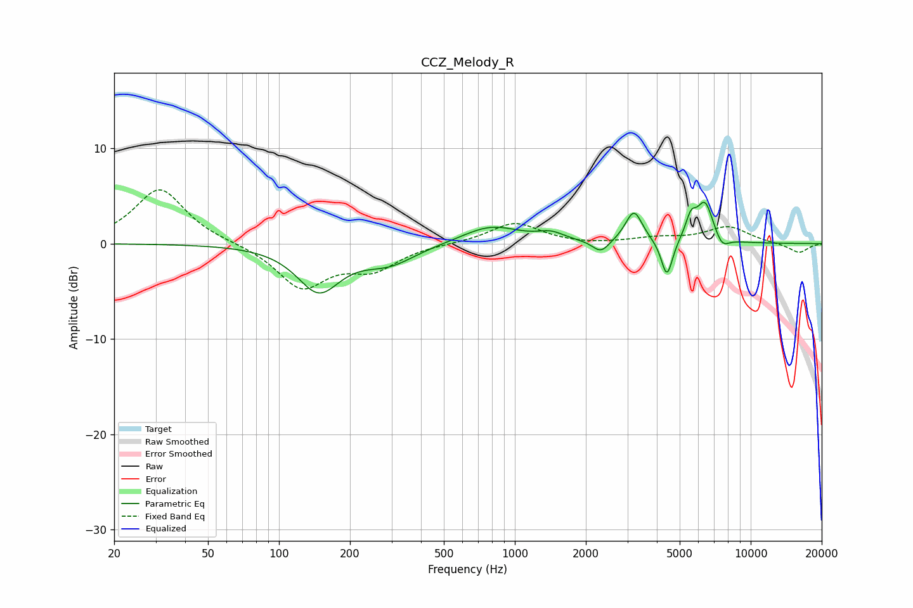

# CCZ_Melody_R
See [usage instructions](https://github.com/jaakkopasanen/AutoEq#usage) for more options and info.

### Parametric EQs
Apply preamp of -4.4 dB when using parametric equalizer.

|   # | Type    |   Fc (Hz) |    Q |   Gain (dB) |
|-----|---------|-----------|------|-------------|
|   1 | Peaking |       147 | 1.55 |        -4.8 |
|   2 | Peaking |       293 | 1.24 |        -1.9 |
|   3 | Peaking |       792 | 1.15 |         1.9 |
|   4 | Peaking |      1424 | 2.55 |         0.8 |
|   5 | Peaking |      2316 | 3.94 |        -1.3 |
|   6 | Peaking |      3198 | 3.91 |         3.3 |
|   7 | Peaking |      4414 | 5.85 |        -4   |
|   8 | Peaking |      5580 | 6    |         2.2 |
|   9 | Peaking |      6403 | 3.84 |         4.2 |
|  10 | Peaking |      7555 | 4.58 |        -1.2 |

### Fixed Band EQs
When using fixed band (also called graphic) equalizer, apply preamp of **-5.7 dB** (if available) and set gains manually with these parameters.

|   # | Type    |   Fc (Hz) |    Q |   Gain (dB) |
|-----|---------|-----------|------|-------------|
|   1 | Peaking |        31 | 1.41 |         5.8 |
|   2 | Peaking |        62 | 1.41 |         0.1 |
|   3 | Peaking |       125 | 1.41 |        -4.5 |
|   4 | Peaking |       250 | 1.41 |        -2.4 |
|   5 | Peaking |       500 | 1.41 |         0   |
|   6 | Peaking |      1000 | 1.41 |         2.2 |
|   7 | Peaking |      2000 | 1.41 |        -0.2 |
|   8 | Peaking |      4000 | 1.41 |         0.5 |
|   9 | Peaking |      8000 | 1.41 |         1.7 |
|  10 | Peaking |     16000 | 1.41 |        -1   |

### Graphs

