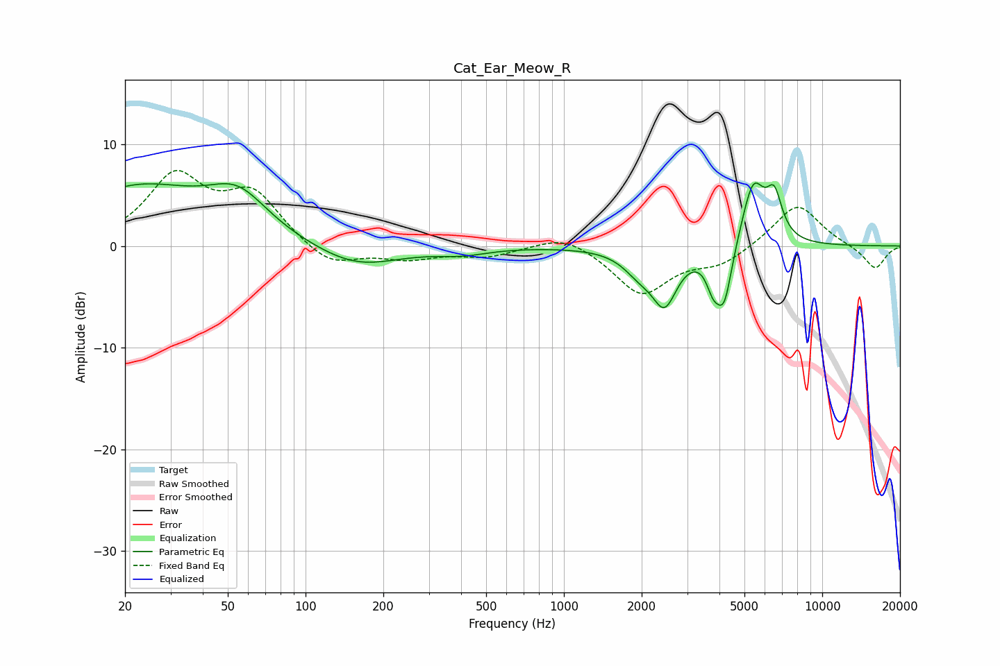

# Cat_Ear_Meow_R
See [usage instructions](https://github.com/jaakkopasanen/AutoEq#usage) for more options and info.

### Parametric EQs
Apply preamp of -6.3 dB when using parametric equalizer.

|   # | Type    |   Fc (Hz) |    Q |   Gain (dB) |
|-----|---------|-----------|------|-------------|
|   1 | Peaking |        22 | 0.54 |         5.6 |
|   2 | Peaking |        55 | 1.23 |         3.7 |
|   3 | Peaking |       157 | 0.87 |        -2.2 |
|   4 | Peaking |       404 | 1.43 |        -0.6 |
|   5 | Peaking |      1964 | 2.24 |        -1.9 |
|   6 | Peaking |      2456 | 2.91 |        -5   |
|   7 | Peaking |      3781 | 5.31 |        -2.5 |
|   8 | Peaking |      4173 | 4.43 |        -5.6 |
|   9 | Peaking |      5406 | 3.03 |         6.4 |
|  10 | Peaking |      6523 | 4.54 |         4   |

### Fixed Band EQs
When using fixed band (also called graphic) equalizer, apply preamp of **-7.5 dB** (if available) and set gains manually with these parameters.

|   # | Type    |   Fc (Hz) |    Q |   Gain (dB) |
|-----|---------|-----------|------|-------------|
|   1 | Peaking |        31 | 1.41 |         6.6 |
|   2 | Peaking |        62 | 1.41 |         4.8 |
|   3 | Peaking |       125 | 1.41 |        -2.1 |
|   4 | Peaking |       250 | 1.41 |        -1.1 |
|   5 | Peaking |       500 | 1.41 |        -0.9 |
|   6 | Peaking |      1000 | 1.41 |         1.4 |
|   7 | Peaking |      2000 | 1.41 |        -4.7 |
|   8 | Peaking |      4000 | 1.41 |        -1.7 |
|   9 | Peaking |      8000 | 1.41 |         4.3 |
|  10 | Peaking |     16000 | 1.41 |        -2.3 |

### Graphs

