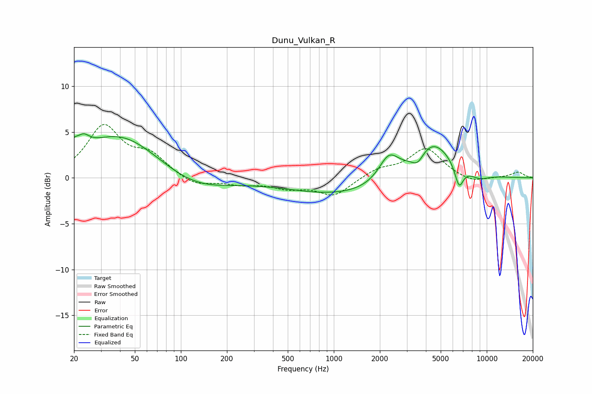

# Dunu_Vulkan_R
See [usage instructions](https://github.com/jaakkopasanen/AutoEq#usage) for more options and info.

### Parametric EQs
Apply preamp of -4.9 dB when using parametric equalizer.

|   # | Type    |   Fc (Hz) |    Q |   Gain (dB) |
|-----|---------|-----------|------|-------------|
|   1 | Peaking |        20 | 5.56 |         1   |
|   2 | Peaking |        23 | 3.51 |         1.3 |
|   3 | Peaking |        40 | 0.56 |         4.8 |
|   4 | Peaking |       122 | 0.65 |        -1.6 |
|   5 | Peaking |      1201 | 0.38 |        -1.9 |
|   6 | Peaking |      2288 | 2.16 |         2.8 |
|   7 | Peaking |      3532 | 3.47 |        -1.3 |
|   8 | Peaking |      4384 | 1.06 |         4.3 |
|   9 | Peaking |      6593 | 4.82 |        -2.4 |
|  10 | Peaking |      8897 | 1.93 |        -0.7 |

### Fixed Band EQs
When using fixed band (also called graphic) equalizer, apply preamp of **-5.9 dB** (if available) and set gains manually with these parameters.

|   # | Type    |   Fc (Hz) |    Q |   Gain (dB) |
|-----|---------|-----------|------|-------------|
|   1 | Peaking |        31 | 1.41 |         5.5 |
|   2 | Peaking |        62 | 1.41 |         2.2 |
|   3 | Peaking |       125 | 1.41 |        -1   |
|   4 | Peaking |       250 | 1.41 |        -0.6 |
|   5 | Peaking |       500 | 1.41 |        -1   |
|   6 | Peaking |      1000 | 1.41 |        -1.9 |
|   7 | Peaking |      2000 | 1.41 |         0.9 |
|   8 | Peaking |      4000 | 1.41 |         3.2 |
|   9 | Peaking |      8000 | 1.41 |        -0.6 |
|  10 | Peaking |     16000 | 1.41 |         0.6 |

### Graphs

