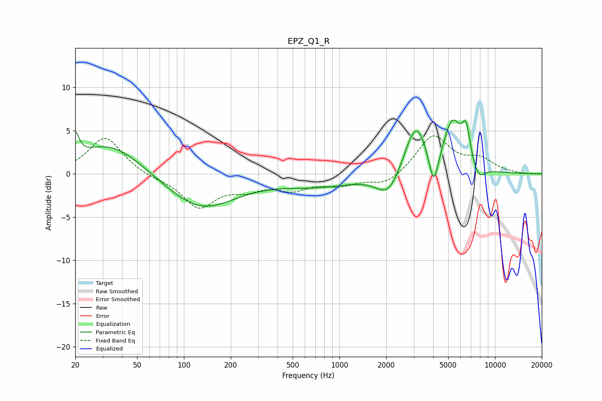

# EPZ_Q1_R
See [usage instructions](https://github.com/jaakkopasanen/AutoEq#usage) for more options and info.

### Parametric EQs
Apply preamp of -6.3 dB when using parametric equalizer.

|   # | Type    |   Fc (Hz) |    Q |   Gain (dB) |
|-----|---------|-----------|------|-------------|
|   1 | Peaking |        20 | 5.99 |         2.7 |
|   2 | Peaking |        34 | 0.68 |         3.7 |
|   3 | Peaking |       128 | 0.63 |        -4.1 |
|   4 | Peaking |       741 | 0.58 |        -1.3 |
|   5 | Peaking |      2070 | 1.82 |        -2.9 |
|   6 | Peaking |      3094 | 1.98 |         6   |
|   7 | Peaking |      4041 | 4.41 |        -4.5 |
|   8 | Peaking |      5331 | 2.31 |         5.7 |
|   9 | Peaking |      6522 | 5.17 |         3.7 |
|  10 | Peaking |      7821 | 3.38 |        -1.7 |

### Fixed Band EQs
When using fixed band (also called graphic) equalizer, apply preamp of **-4.5 dB** (if available) and set gains manually with these parameters.

|   # | Type    |   Fc (Hz) |    Q |   Gain (dB) |
|-----|---------|-----------|------|-------------|
|   1 | Peaking |        31 | 1.41 |         4.3 |
|   2 | Peaking |        62 | 1.41 |        -0.4 |
|   3 | Peaking |       125 | 1.41 |        -3.7 |
|   4 | Peaking |       250 | 1.41 |        -1.4 |
|   5 | Peaking |       500 | 1.41 |        -1.5 |
|   6 | Peaking |      1000 | 1.41 |        -1.1 |
|   7 | Peaking |      2000 | 1.41 |        -1.3 |
|   8 | Peaking |      4000 | 1.41 |         4.4 |
|   9 | Peaking |      8000 | 1.41 |         1.5 |
|  10 | Peaking |     16000 | 1.41 |        -0   |

### Graphs

