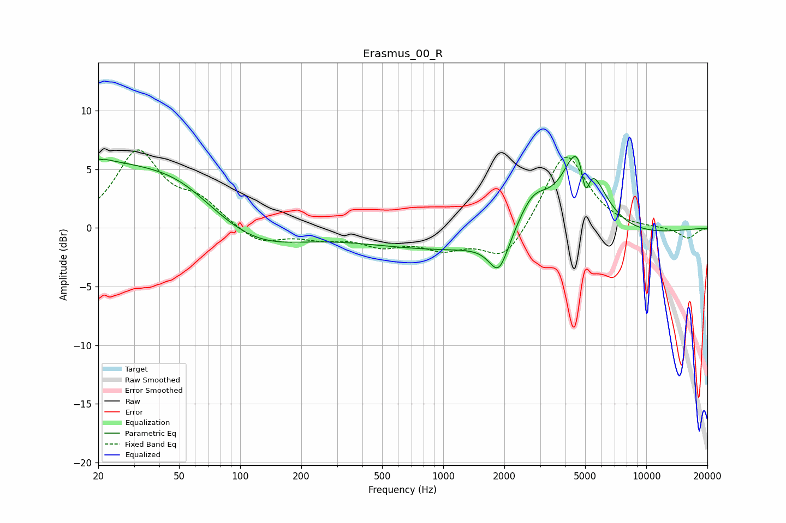

# Erasmus_00_R
See [usage instructions](https://github.com/jaakkopasanen/AutoEq#usage) for more options and info.

### Parametric EQs
Apply preamp of -6.2 dB when using parametric equalizer.

|   # | Type    |   Fc (Hz) |    Q |   Gain (dB) |
|-----|---------|-----------|------|-------------|
|   1 | Peaking |        20 | 0.37 |         5.4 |
|   2 | Peaking |        21 | 5.49 |         3.3 |
|   3 | Peaking |        21 | 5.88 |        -3   |
|   4 | Peaking |        51 | 0.85 |         1.4 |
|   5 | Peaking |       120 | 0.66 |        -1.9 |
|   6 | Peaking |      1879 | 2.94 |        -3   |
|   7 | Peaking |      2103 | 0.19 |        -2.2 |
|   8 | Peaking |      2764 | 1.71 |         3.3 |
|   9 | Peaking |      4797 | 1.6  |         9.2 |
|  10 | Peaking |      5016 | 6    |        -4.1 |

### Fixed Band EQs
When using fixed band (also called graphic) equalizer, apply preamp of **-6.7 dB** (if available) and set gains manually with these parameters.

|   # | Type    |   Fc (Hz) |    Q |   Gain (dB) |
|-----|---------|-----------|------|-------------|
|   1 | Peaking |        31 | 1.41 |         6.3 |
|   2 | Peaking |        62 | 1.41 |         2   |
|   3 | Peaking |       125 | 1.41 |        -1.4 |
|   4 | Peaking |       250 | 1.41 |        -0.7 |
|   5 | Peaking |       500 | 1.41 |        -1.3 |
|   6 | Peaking |      1000 | 1.41 |        -1.5 |
|   7 | Peaking |      2000 | 1.41 |        -2.9 |
|   8 | Peaking |      4000 | 1.41 |         6.6 |
|   9 | Peaking |      8000 | 1.41 |        -0.1 |
|  10 | Peaking |     16000 | 1.41 |        -0.9 |

### Graphs

