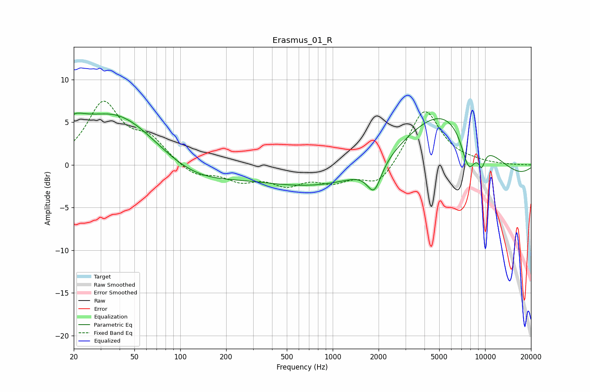

# Erasmus_01_R
See [usage instructions](https://github.com/jaakkopasanen/AutoEq#usage) for more options and info.

### Parametric EQs
Apply preamp of -6.2 dB when using parametric equalizer.

|   # | Type    |   Fc (Hz) |    Q |   Gain (dB) |
|-----|---------|-----------|------|-------------|
|   1 | Peaking |        20 | 5.34 |         0.4 |
|   2 | Peaking |        21 | 1.81 |         1.8 |
|   3 | Peaking |        38 | 0.53 |         6.1 |
|   4 | Peaking |       122 | 0.61 |        -2.2 |
|   5 | Peaking |       733 | 0.36 |        -2.2 |
|   6 | Peaking |      1872 | 3.05 |        -3.3 |
|   7 | Peaking |      5320 | 0.42 |        10.3 |
|   8 | Peaking |      6433 | 0.18 |        -4   |
|   9 | Peaking |      7791 | 2.65 |        -4.6 |
|  10 | Peaking |      9487 | 5.67 |        -1.9 |

### Fixed Band EQs
When using fixed band (also called graphic) equalizer, apply preamp of **-7.6 dB** (if available) and set gains manually with these parameters.

|   # | Type    |   Fc (Hz) |    Q |   Gain (dB) |
|-----|---------|-----------|------|-------------|
|   1 | Peaking |        31 | 1.41 |         7   |
|   2 | Peaking |        62 | 1.41 |         2.7 |
|   3 | Peaking |       125 | 1.41 |        -1.4 |
|   4 | Peaking |       250 | 1.41 |        -1.6 |
|   5 | Peaking |       500 | 1.41 |        -2   |
|   6 | Peaking |      1000 | 1.41 |        -1.7 |
|   7 | Peaking |      2000 | 1.41 |        -2.5 |
|   8 | Peaking |      4000 | 1.41 |         6.7 |
|   9 | Peaking |      8000 | 1.41 |         0.2 |
|  10 | Peaking |     16000 | 1.41 |        -0   |

### Graphs

