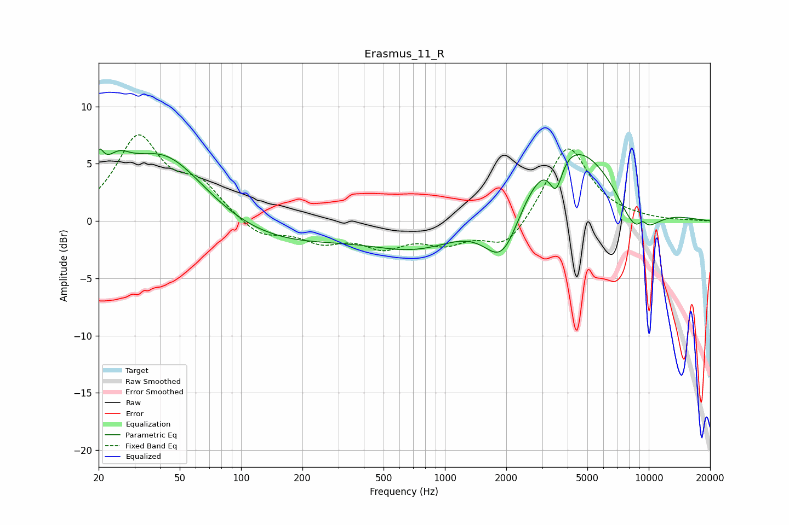

# Erasmus_11_R
See [usage instructions](https://github.com/jaakkopasanen/AutoEq#usage) for more options and info.

### Parametric EQs
Apply preamp of -6.4 dB when using parametric equalizer.

|   # | Type    |   Fc (Hz) |    Q |   Gain (dB) |
|-----|---------|-----------|------|-------------|
|   1 | Peaking |        20 | 6    |         2.4 |
|   2 | Peaking |        25 | 2.22 |         2.1 |
|   3 | Peaking |        42 | 0.67 |         6.3 |
|   4 | Peaking |       132 | 0.41 |        -2.2 |
|   5 | Peaking |       777 | 0.59 |        -2.7 |
|   6 | Peaking |      1924 | 1.44 |        -6.1 |
|   7 | Peaking |      3507 | 4.36 |        -3   |
|   8 | Peaking |      3883 | 0.51 |         8.2 |
|   9 | Peaking |      8748 | 1.29 |        -4.3 |
|  10 | Peaking |      9323 | 5.77 |         0.8 |

### Fixed Band EQs
When using fixed band (also called graphic) equalizer, apply preamp of **-7.6 dB** (if available) and set gains manually with these parameters.

|   # | Type    |   Fc (Hz) |    Q |   Gain (dB) |
|-----|---------|-----------|------|-------------|
|   1 | Peaking |        31 | 1.41 |         7.1 |
|   2 | Peaking |        62 | 1.41 |         2.8 |
|   3 | Peaking |       125 | 1.41 |        -1.4 |
|   4 | Peaking |       250 | 1.41 |        -1.6 |
|   5 | Peaking |       500 | 1.41 |        -2   |
|   6 | Peaking |      1000 | 1.41 |        -1.6 |
|   7 | Peaking |      2000 | 1.41 |        -2.5 |
|   8 | Peaking |      4000 | 1.41 |         6.8 |
|   9 | Peaking |      8000 | 1.41 |         0.1 |
|  10 | Peaking |     16000 | 1.41 |         0   |

### Graphs

