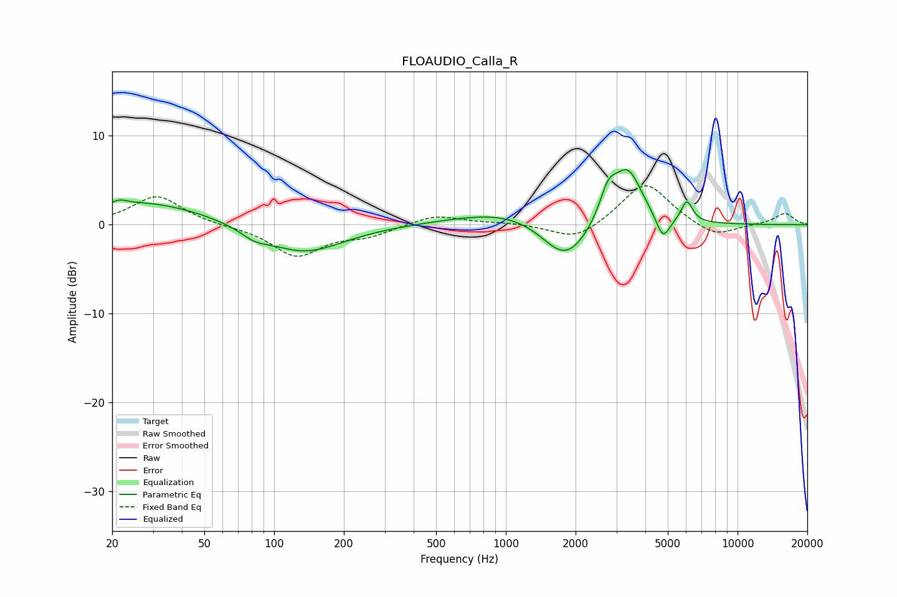

# FLOAUDIO_Calla_R
See [usage instructions](https://github.com/jaakkopasanen/AutoEq#usage) for more options and info.

### Parametric EQs
Apply preamp of -6.3 dB when using parametric equalizer.

|   # | Type    |   Fc (Hz) |    Q |   Gain (dB) |
|-----|---------|-----------|------|-------------|
|   1 | Peaking |        22 | 4.95 |         0.4 |
|   2 | Peaking |        27 | 0.5  |         2.6 |
|   3 | Peaking |        82 | 2.46 |        -0.9 |
|   4 | Peaking |       134 | 0.82 |        -3.3 |
|   5 | Peaking |      1076 | 0.61 |         1.8 |
|   6 | Peaking |      1810 | 1.36 |        -5   |
|   7 | Peaking |      2764 | 3.83 |         3.1 |
|   8 | Peaking |      3354 | 2.21 |         6.1 |
|   9 | Peaking |      4765 | 4.6  |        -2.8 |
|  10 | Peaking |      6045 | 5.74 |         2.4 |

### Fixed Band EQs
When using fixed band (also called graphic) equalizer, apply preamp of **-4.5 dB** (if available) and set gains manually with these parameters.

|   # | Type    |   Fc (Hz) |    Q |   Gain (dB) |
|-----|---------|-----------|------|-------------|
|   1 | Peaking |        31 | 1.41 |         3.3 |
|   2 | Peaking |        62 | 1.41 |        -0.1 |
|   3 | Peaking |       125 | 1.41 |        -3.5 |
|   4 | Peaking |       250 | 1.41 |        -1.1 |
|   5 | Peaking |       500 | 1.41 |         1.1 |
|   6 | Peaking |      1000 | 1.41 |         0.2 |
|   7 | Peaking |      2000 | 1.41 |        -1.9 |
|   8 | Peaking |      4000 | 1.41 |         4.9 |
|   9 | Peaking |      8000 | 1.41 |        -1.5 |
|  10 | Peaking |     16000 | 1.41 |         1.3 |

### Graphs

