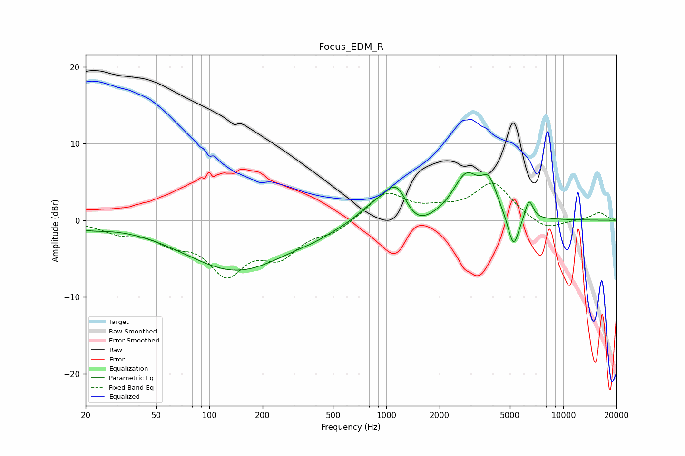

# Focus_EDM_R
See [usage instructions](https://github.com/jaakkopasanen/AutoEq#usage) for more options and info.

### Parametric EQs
Apply preamp of -6.3 dB when using parametric equalizer.

|   # | Type    |   Fc (Hz) |    Q |   Gain (dB) |
|-----|---------|-----------|------|-------------|
|   1 | Peaking |        21 | 1.39 |        -0.7 |
|   2 | Peaking |       143 | 0.47 |        -6.5 |
|   3 | Peaking |       389 | 1.7  |        -0.4 |
|   4 | Peaking |       847 | 1.47 |         1.9 |
|   5 | Peaking |      1147 | 2.06 |         4.8 |
|   6 | Peaking |      1446 | 1.63 |        -2.3 |
|   7 | Peaking |      2827 | 1.88 |         5.5 |
|   8 | Peaking |      3805 | 3.12 |         3.9 |
|   9 | Peaking |      5233 | 4.42 |        -4.5 |
|  10 | Peaking |      6410 | 6    |         2.6 |

### Fixed Band EQs
When using fixed band (also called graphic) equalizer, apply preamp of **-5.0 dB** (if available) and set gains manually with these parameters.

|   # | Type    |   Fc (Hz) |    Q |   Gain (dB) |
|-----|---------|-----------|------|-------------|
|   1 | Peaking |        31 | 1.41 |        -1.4 |
|   2 | Peaking |        62 | 1.41 |        -2.2 |
|   3 | Peaking |       125 | 1.41 |        -6.3 |
|   4 | Peaking |       250 | 1.41 |        -4   |
|   5 | Peaking |       500 | 1.41 |        -1.4 |
|   6 | Peaking |      1000 | 1.41 |         3.6 |
|   7 | Peaking |      2000 | 1.41 |         1   |
|   8 | Peaking |      4000 | 1.41 |         4.8 |
|   9 | Peaking |      8000 | 1.41 |        -1.4 |
|  10 | Peaking |     16000 | 1.41 |         1   |

### Graphs

