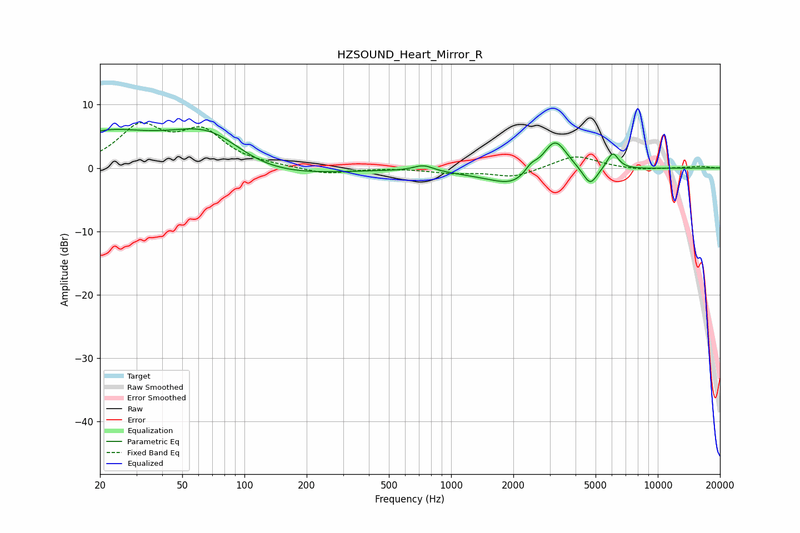

# HZSOUND_Heart_Mirror_R
See [usage instructions](https://github.com/jaakkopasanen/AutoEq#usage) for more options and info.

### Parametric EQs
Apply preamp of -6.3 dB when using parametric equalizer.

|   # | Type    |   Fc (Hz) |    Q |   Gain (dB) |
|-----|---------|-----------|------|-------------|
|   1 | Peaking |        20 | 0.68 |         4.4 |
|   2 | Peaking |        70 | 0.6  |        10.1 |
|   3 | Peaking |        99 | 0.5  |        -6   |
|   4 | Peaking |       735 | 2.96 |         1   |
|   5 | Peaking |      1995 | 1.7  |        -1   |
|   6 | Peaking |      2186 | 0.7  |        -2.3 |
|   7 | Peaking |      2435 | 4.41 |         1.4 |
|   8 | Peaking |      3177 | 2.29 |         5.9 |
|   9 | Peaking |      4707 | 4.07 |        -2.8 |
|  10 | Peaking |      6047 | 4.84 |         2.7 |

### Fixed Band EQs
When using fixed band (also called graphic) equalizer, apply preamp of **-7.3 dB** (if available) and set gains manually with these parameters.

|   # | Type    |   Fc (Hz) |    Q |   Gain (dB) |
|-----|---------|-----------|------|-------------|
|   1 | Peaking |        31 | 1.41 |         6.1 |
|   2 | Peaking |        62 | 1.41 |         5.3 |
|   3 | Peaking |       125 | 1.41 |         0.2 |
|   4 | Peaking |       250 | 1.41 |        -1   |
|   5 | Peaking |       500 | 1.41 |         0   |
|   6 | Peaking |      1000 | 1.41 |        -0.7 |
|   7 | Peaking |      2000 | 1.41 |        -1.4 |
|   8 | Peaking |      4000 | 1.41 |         2.1 |
|   9 | Peaking |      8000 | 1.41 |        -0.3 |
|  10 | Peaking |     16000 | 1.41 |         0.3 |

### Graphs

