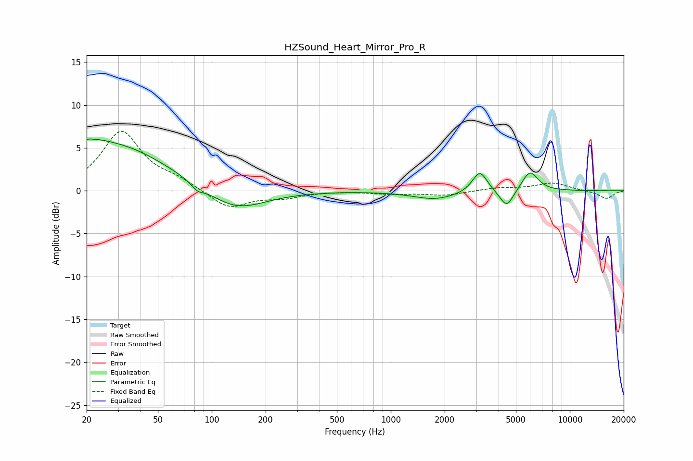

# HZSound_Heart_Mirror_Pro_R
See [usage instructions](https://github.com/jaakkopasanen/AutoEq#usage) for more options and info.

### Parametric EQs
Apply preamp of -6.1 dB when using parametric equalizer.

|   # | Type    |   Fc (Hz) |    Q |   Gain (dB) |
|-----|---------|-----------|------|-------------|
|   1 | Peaking |        21 | 5.76 |         3.3 |
|   2 | Peaking |        21 | 6    |        -2.9 |
|   3 | Peaking |        22 | 1.89 |         0.7 |
|   4 | Peaking |        28 | 0.47 |         5.4 |
|   5 | Peaking |        83 | 4.39 |        -0.7 |
|   6 | Peaking |       135 | 0.87 |        -2.6 |
|   7 | Peaking |      1781 | 1.11 |        -1   |
|   8 | Peaking |      3141 | 3.42 |         2.5 |
|   9 | Peaking |      4440 | 3.68 |        -2.1 |
|  10 | Peaking |      5989 | 3.08 |         2.3 |

### Fixed Band EQs
When using fixed band (also called graphic) equalizer, apply preamp of **-7.0 dB** (if available) and set gains manually with these parameters.

|   # | Type    |   Fc (Hz) |    Q |   Gain (dB) |
|-----|---------|-----------|------|-------------|
|   1 | Peaking |        31 | 1.41 |         6.8 |
|   2 | Peaking |        62 | 1.41 |         1   |
|   3 | Peaking |       125 | 1.41 |        -2.1 |
|   4 | Peaking |       250 | 1.41 |        -0.7 |
|   5 | Peaking |       500 | 1.41 |         0   |
|   6 | Peaking |      1000 | 1.41 |        -0.3 |
|   7 | Peaking |      2000 | 1.41 |        -0.5 |
|   8 | Peaking |      4000 | 1.41 |         0.3 |
|   9 | Peaking |      8000 | 1.41 |         0.9 |
|  10 | Peaking |     16000 | 1.41 |        -0.9 |

### Graphs

