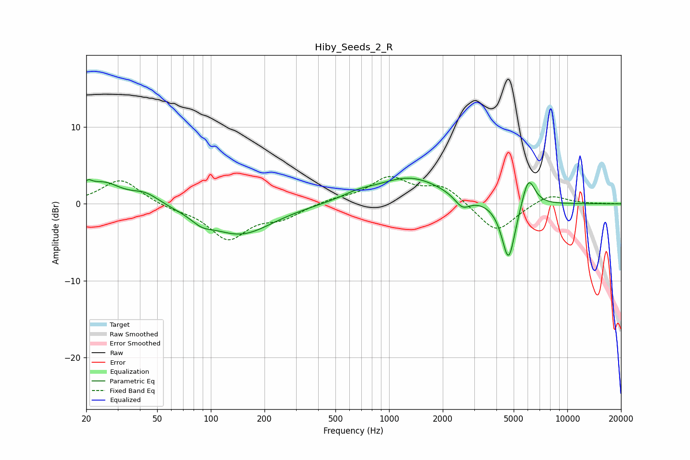

# Hiby_Seeds_2_R
See [usage instructions](https://github.com/jaakkopasanen/AutoEq#usage) for more options and info.

### Parametric EQs
Apply preamp of -3.4 dB when using parametric equalizer.

|   # | Type    |   Fc (Hz) |    Q |   Gain (dB) |
|-----|---------|-----------|------|-------------|
|   1 | Peaking |        20 | 5.75 |         1.1 |
|   2 | Peaking |        25 | 1.42 |         2.6 |
|   3 | Peaking |        43 | 1.78 |         1.4 |
|   4 | Peaking |        89 | 2.42 |        -1   |
|   5 | Peaking |       147 | 0.79 |        -4   |
|   6 | Peaking |       664 | 1.55 |         0.7 |
|   7 | Peaking |      1310 | 0.75 |         3.4 |
|   8 | Peaking |      2579 | 3.24 |        -1.6 |
|   9 | Peaking |      4680 | 3.6  |        -7.8 |
|  10 | Peaking |      6046 | 3.73 |         4   |

### Fixed Band EQs
When using fixed band (also called graphic) equalizer, apply preamp of **-3.7 dB** (if available) and set gains manually with these parameters.

|   # | Type    |   Fc (Hz) |    Q |   Gain (dB) |
|-----|---------|-----------|------|-------------|
|   1 | Peaking |        31 | 1.41 |         3.3 |
|   2 | Peaking |        62 | 1.41 |        -0.5 |
|   3 | Peaking |       125 | 1.41 |        -4.4 |
|   4 | Peaking |       250 | 1.41 |        -1.6 |
|   5 | Peaking |       500 | 1.41 |         0.6 |
|   6 | Peaking |      1000 | 1.41 |         3.2 |
|   7 | Peaking |      2000 | 1.41 |         2.3 |
|   8 | Peaking |      4000 | 1.41 |        -3.9 |
|   9 | Peaking |      8000 | 1.41 |         1.4 |
|  10 | Peaking |     16000 | 1.41 |         0   |

### Graphs

