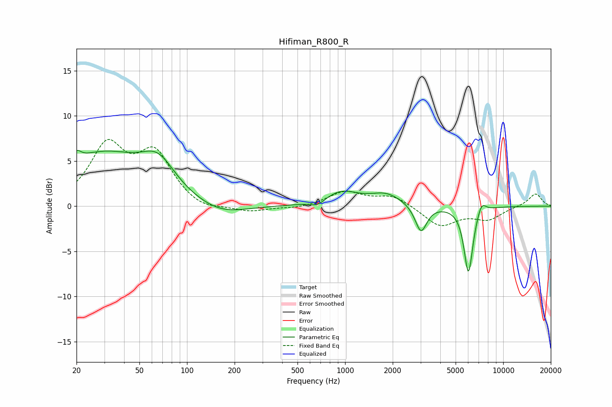

# Hifiman_R800_R
See [usage instructions](https://github.com/jaakkopasanen/AutoEq#usage) for more options and info.

### Parametric EQs
Apply preamp of -6.3 dB when using parametric equalizer.

|   # | Type    |   Fc (Hz) |    Q |   Gain (dB) |
|-----|---------|-----------|------|-------------|
|   1 | Peaking |        20 | 5.27 |         1.1 |
|   2 | Peaking |        29 | 0.5  |         5.6 |
|   3 | Peaking |        66 | 1.38 |         3.1 |
|   4 | Peaking |       161 | 0.89 |        -1.3 |
|   5 | Peaking |       670 | 3.07 |        -0.6 |
|   6 | Peaking |       946 | 1.36 |         1.5 |
|   7 | Peaking |      1821 | 1.4  |         1.3 |
|   8 | Peaking |      3020 | 3.86 |        -3.1 |
|   9 | Peaking |      6027 | 4.9  |        -7.4 |
|  10 | Peaking |      7297 | 5.06 |         1.3 |

### Fixed Band EQs
When using fixed band (also called graphic) equalizer, apply preamp of **-7.5 dB** (if available) and set gains manually with these parameters.

|   # | Type    |   Fc (Hz) |    Q |   Gain (dB) |
|-----|---------|-----------|------|-------------|
|   1 | Peaking |        31 | 1.41 |         6.4 |
|   2 | Peaking |        62 | 1.41 |         5.4 |
|   3 | Peaking |       125 | 1.41 |        -0.7 |
|   4 | Peaking |       250 | 1.41 |        -0.6 |
|   5 | Peaking |       500 | 1.41 |        -0.3 |
|   6 | Peaking |      1000 | 1.41 |         1.6 |
|   7 | Peaking |      2000 | 1.41 |         1.2 |
|   8 | Peaking |      4000 | 1.41 |        -2.2 |
|   9 | Peaking |      8000 | 1.41 |        -1.4 |
|  10 | Peaking |     16000 | 1.41 |         1.4 |

### Graphs

