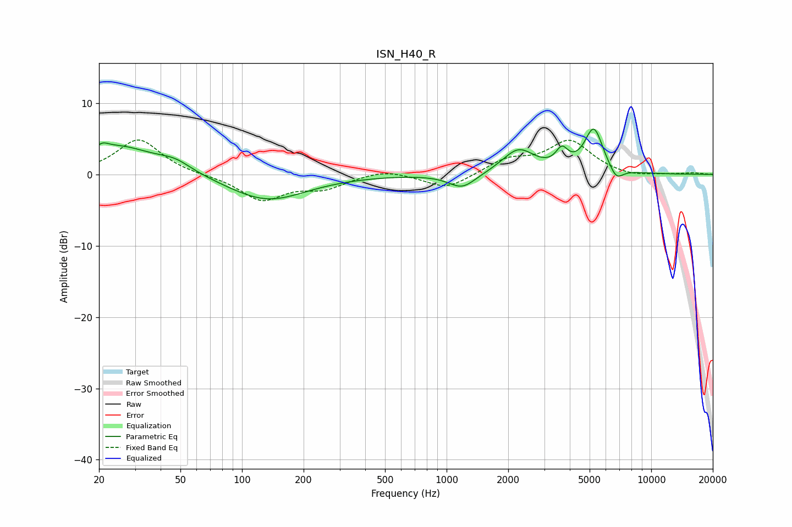

# ISN_H40_R
See [usage instructions](https://github.com/jaakkopasanen/AutoEq#usage) for more options and info.

### Parametric EQs
Apply preamp of -6.5 dB when using parametric equalizer.

|   # | Type    |   Fc (Hz) |    Q |   Gain (dB) |
|-----|---------|-----------|------|-------------|
|   1 | Peaking |        21 | 6    |        -2.5 |
|   2 | Peaking |        21 | 5.81 |         3.3 |
|   3 | Peaking |        24 | 0.75 |         4   |
|   4 | Peaking |        47 | 1.79 |         1.2 |
|   5 | Peaking |       132 | 0.74 |        -3.7 |
|   6 | Peaking |      1193 | 2.11 |        -2.1 |
|   7 | Peaking |      2247 | 1.8  |         3.4 |
|   8 | Peaking |      3662 | 4.75 |         2.4 |
|   9 | Peaking |      5243 | 3.05 |         6.3 |
|  10 | Peaking |      6740 | 4    |        -1.8 |

### Fixed Band EQs
When using fixed band (also called graphic) equalizer, apply preamp of **-4.9 dB** (if available) and set gains manually with these parameters.

|   # | Type    |   Fc (Hz) |    Q |   Gain (dB) |
|-----|---------|-----------|------|-------------|
|   1 | Peaking |        31 | 1.41 |         5   |
|   2 | Peaking |        62 | 1.41 |        -0.1 |
|   3 | Peaking |       125 | 1.41 |        -3.5 |
|   4 | Peaking |       250 | 1.41 |        -1.7 |
|   5 | Peaking |       500 | 1.41 |         0.8 |
|   6 | Peaking |      1000 | 1.41 |        -2.1 |
|   7 | Peaking |      2000 | 1.41 |         1.9 |
|   8 | Peaking |      4000 | 1.41 |         4.6 |
|   9 | Peaking |      8000 | 1.41 |        -0.5 |
|  10 | Peaking |     16000 | 1.41 |         0.2 |

### Graphs

