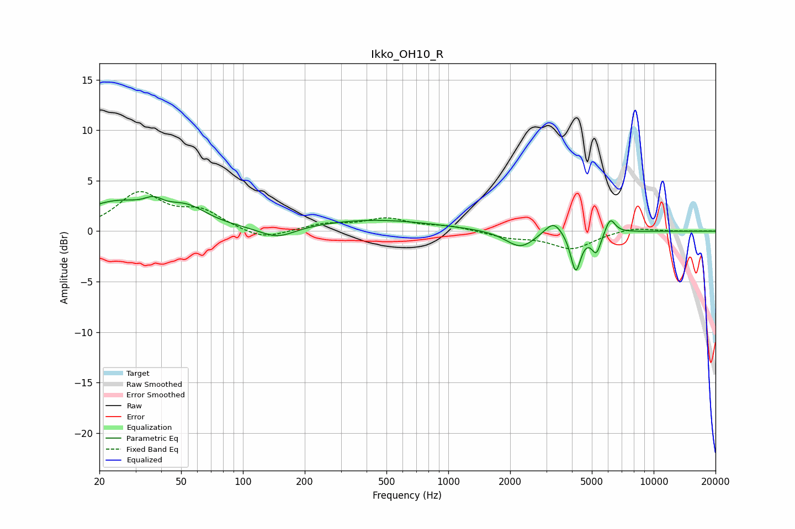

# Ikko_OH10_R
See [usage instructions](https://github.com/jaakkopasanen/AutoEq#usage) for more options and info.

### Parametric EQs
Apply preamp of -3.5 dB when using parametric equalizer.

|   # | Type    |   Fc (Hz) |    Q |   Gain (dB) |
|-----|---------|-----------|------|-------------|
|   1 | Peaking |        24 | 0.8  |         2.7 |
|   2 | Peaking |        37 | 3.3  |         0.9 |
|   3 | Peaking |        54 | 1.4  |         1.7 |
|   4 | Peaking |       147 | 1.64 |        -1.1 |
|   5 | Peaking |       432 | 0.47 |         1.1 |
|   6 | Peaking |      2245 | 1.99 |        -1.7 |
|   7 | Peaking |      3253 | 3.34 |         1.4 |
|   8 | Peaking |      4173 | 5.73 |        -3.9 |
|   9 | Peaking |      5258 | 6    |        -2   |
|  10 | Peaking |      6144 | 5.72 |         1.5 |

### Fixed Band EQs
When using fixed band (also called graphic) equalizer, apply preamp of **-4.0 dB** (if available) and set gains manually with these parameters.

|   # | Type    |   Fc (Hz) |    Q |   Gain (dB) |
|-----|---------|-----------|------|-------------|
|   1 | Peaking |        31 | 1.41 |         3.6 |
|   2 | Peaking |        62 | 1.41 |         1.8 |
|   3 | Peaking |       125 | 1.41 |        -1   |
|   4 | Peaking |       250 | 1.41 |         0.7 |
|   5 | Peaking |       500 | 1.41 |         1.2 |
|   6 | Peaking |      1000 | 1.41 |         0.5 |
|   7 | Peaking |      2000 | 1.41 |        -0.6 |
|   8 | Peaking |      4000 | 1.41 |        -1.7 |
|   9 | Peaking |      8000 | 1.41 |         0.4 |
|  10 | Peaking |     16000 | 1.41 |         0   |

### Graphs

