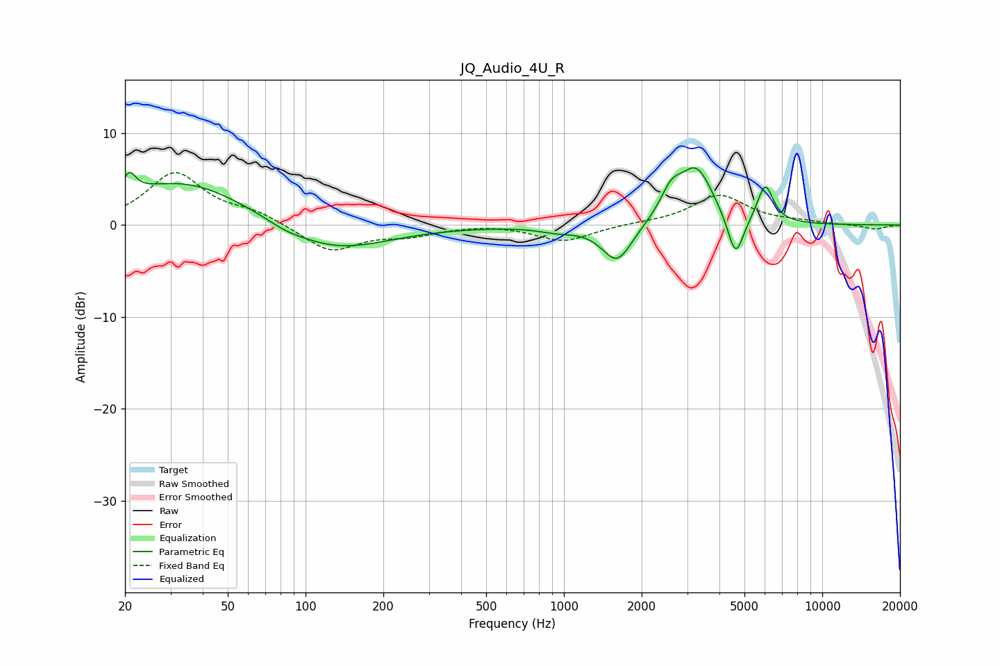

# JQ_Audio_4U_R
See [usage instructions](https://github.com/jaakkopasanen/AutoEq#usage) for more options and info.

### Parametric EQs
Apply preamp of -6.3 dB when using parametric equalizer.

|   # | Type    |   Fc (Hz) |    Q |   Gain (dB) |
|-----|---------|-----------|------|-------------|
|   1 | Peaking |        21 | 5.86 |         2.2 |
|   2 | Peaking |        34 | 0.55 |         4.9 |
|   3 | Peaking |        84 | 2.22 |        -0.4 |
|   4 | Peaking |       127 | 0.68 |        -3.1 |
|   5 | Peaking |       939 | 1.97 |        -0.5 |
|   6 | Peaking |      1607 | 2.41 |        -4.2 |
|   7 | Peaking |      2601 | 3.31 |         2.7 |
|   8 | Peaking |      3260 | 2.14 |         6   |
|   9 | Peaking |      4620 | 4.47 |        -4.9 |
|  10 | Peaking |      6017 | 4.48 |         4.2 |

### Fixed Band EQs
When using fixed band (also called graphic) equalizer, apply preamp of **-5.8 dB** (if available) and set gains manually with these parameters.

|   # | Type    |   Fc (Hz) |    Q |   Gain (dB) |
|-----|---------|-----------|------|-------------|
|   1 | Peaking |        31 | 1.41 |         5.6 |
|   2 | Peaking |        62 | 1.41 |         1.2 |
|   3 | Peaking |       125 | 1.41 |        -2.9 |
|   4 | Peaking |       250 | 1.41 |        -1   |
|   5 | Peaking |       500 | 1.41 |         0.2 |
|   6 | Peaking |      1000 | 1.41 |        -1.8 |
|   7 | Peaking |      2000 | 1.41 |         0.1 |
|   8 | Peaking |      4000 | 1.41 |         3.2 |
|   9 | Peaking |      8000 | 1.41 |         0.3 |
|  10 | Peaking |     16000 | 1.41 |        -0.5 |

### Graphs

