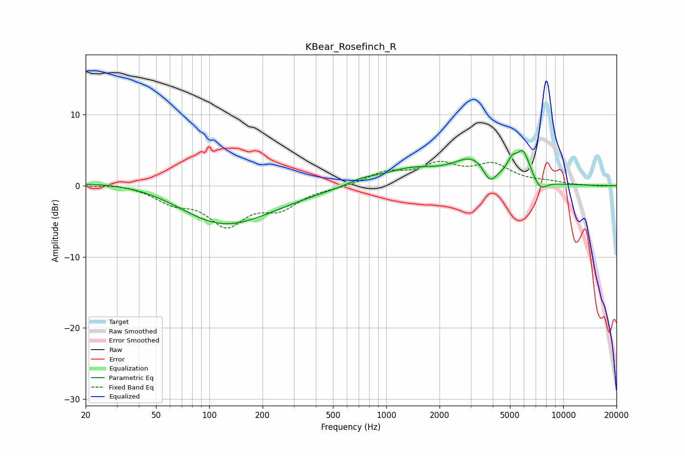

# KBear_Rosefinch_R
See [usage instructions](https://github.com/jaakkopasanen/AutoEq#usage) for more options and info.

### Parametric EQs
Apply preamp of -5.0 dB when using parametric equalizer.

|   # | Type    |   Fc (Hz) |    Q |   Gain (dB) |
|-----|---------|-----------|------|-------------|
|   1 | Peaking |        53 | 0.38 |         1.4 |
|   2 | Peaking |       109 | 0.56 |        -5.1 |
|   3 | Peaking |       174 | 0.51 |        -1.5 |
|   4 | Peaking |       735 | 1.69 |         0.7 |
|   5 | Peaking |      1365 | 0.9  |         2.1 |
|   6 | Peaking |      3152 | 1.23 |         3.7 |
|   7 | Peaking |      3844 | 3.5  |        -2.7 |
|   8 | Peaking |      5133 | 5.67 |         1.6 |
|   9 | Peaking |      5933 | 3.48 |         4   |
|  10 | Peaking |      7405 | 3.56 |        -1.5 |

### Fixed Band EQs
When using fixed band (also called graphic) equalizer, apply preamp of **-3.5 dB** (if available) and set gains manually with these parameters.

|   # | Type    |   Fc (Hz) |    Q |   Gain (dB) |
|-----|---------|-----------|------|-------------|
|   1 | Peaking |        31 | 1.41 |         0.4 |
|   2 | Peaking |        62 | 1.41 |        -2   |
|   3 | Peaking |       125 | 1.41 |        -5.1 |
|   4 | Peaking |       250 | 1.41 |        -2.8 |
|   5 | Peaking |       500 | 1.41 |        -0.2 |
|   6 | Peaking |      1000 | 1.41 |         1.7 |
|   7 | Peaking |      2000 | 1.41 |         2.7 |
|   8 | Peaking |      4000 | 1.41 |         2.7 |
|   9 | Peaking |      8000 | 1.41 |         0.4 |
|  10 | Peaking |     16000 | 1.41 |        -0.1 |

### Graphs

