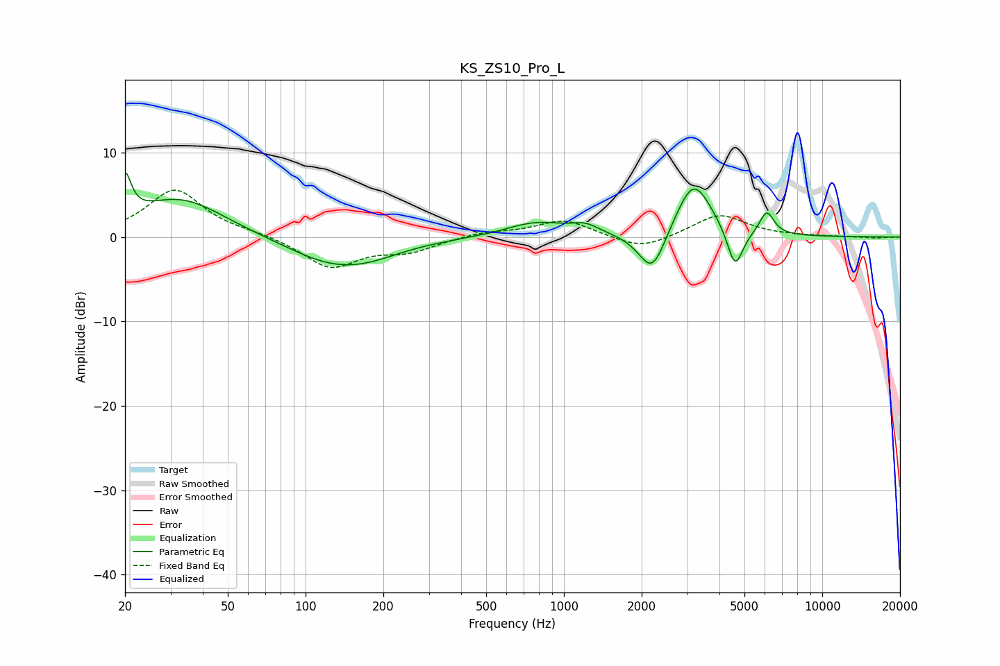

# KS_ZS10_Pro_L
See [usage instructions](https://github.com/jaakkopasanen/AutoEq#usage) for more options and info.

### Parametric EQs
Apply preamp of -7.7 dB when using parametric equalizer.

|   # | Type    |   Fc (Hz) |    Q |   Gain (dB) |
|-----|---------|-----------|------|-------------|
|   1 | Peaking |        20 | 6    |         5   |
|   2 | Peaking |        33 | 0.81 |         4.6 |
|   3 | Peaking |       129 | 0.79 |        -3.2 |
|   4 | Peaking |       180 | 1.15 |        -0.7 |
|   5 | Peaking |       783 | 1.2  |         1.7 |
|   6 | Peaking |      1213 | 2.61 |         1   |
|   7 | Peaking |      2199 | 2.65 |        -5.3 |
|   8 | Peaking |      3174 | 2    |         6.9 |
|   9 | Peaking |      4598 | 4.53 |        -4.9 |
|  10 | Peaking |      6099 | 5.01 |         2.8 |

### Fixed Band EQs
When using fixed band (also called graphic) equalizer, apply preamp of **-5.6 dB** (if available) and set gains manually with these parameters.

|   # | Type    |   Fc (Hz) |    Q |   Gain (dB) |
|-----|---------|-----------|------|-------------|
|   1 | Peaking |        31 | 1.41 |         5.6 |
|   2 | Peaking |        62 | 1.41 |         0.4 |
|   3 | Peaking |       125 | 1.41 |        -3.6 |
|   4 | Peaking |       250 | 1.41 |        -1.5 |
|   5 | Peaking |       500 | 1.41 |         0.6 |
|   6 | Peaking |      1000 | 1.41 |         2   |
|   7 | Peaking |      2000 | 1.41 |        -1.6 |
|   8 | Peaking |      4000 | 1.41 |         2.7 |
|   9 | Peaking |      8000 | 1.41 |         0   |
|  10 | Peaking |     16000 | 1.41 |        -0.1 |

### Graphs

