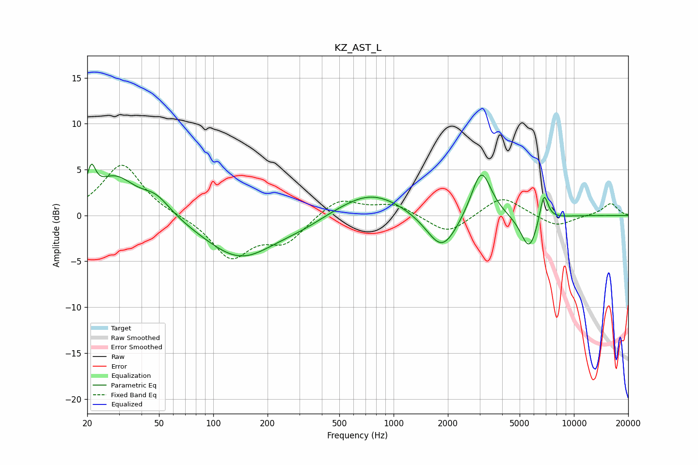

# KZ_AST_L
See [usage instructions](https://github.com/jaakkopasanen/AutoEq#usage) for more options and info.

### Parametric EQs
Apply preamp of -5.7 dB when using parametric equalizer.

|   # | Type    |   Fc (Hz) |    Q |   Gain (dB) |
|-----|---------|-----------|------|-------------|
|   1 | Peaking |        21 | 5.99 |         3.1 |
|   2 | Peaking |        28 | 1.26 |         4   |
|   3 | Peaking |        48 | 1.71 |         1.9 |
|   4 | Peaking |       141 | 0.72 |        -4.6 |
|   5 | Peaking |       312 | 1.12 |        -0.6 |
|   6 | Peaking |       748 | 0.78 |         2.7 |
|   7 | Peaking |      1857 | 1.63 |        -4.3 |
|   8 | Peaking |      3063 | 2.54 |         5.4 |
|   9 | Peaking |      5646 | 2.95 |        -3.9 |
|  10 | Peaking |      6816 | 5.8  |         3.3 |

### Fixed Band EQs
When using fixed band (also called graphic) equalizer, apply preamp of **-5.6 dB** (if available) and set gains manually with these parameters.

|   # | Type    |   Fc (Hz) |    Q |   Gain (dB) |
|-----|---------|-----------|------|-------------|
|   1 | Peaking |        31 | 1.41 |         5.6 |
|   2 | Peaking |        62 | 1.41 |        -0   |
|   3 | Peaking |       125 | 1.41 |        -4.5 |
|   4 | Peaking |       250 | 1.41 |        -2.7 |
|   5 | Peaking |       500 | 1.41 |         2   |
|   6 | Peaking |      1000 | 1.41 |         1.2 |
|   7 | Peaking |      2000 | 1.41 |        -2.1 |
|   8 | Peaking |      4000 | 1.41 |         2.2 |
|   9 | Peaking |      8000 | 1.41 |        -1.3 |
|  10 | Peaking |     16000 | 1.41 |         1.3 |

### Graphs

