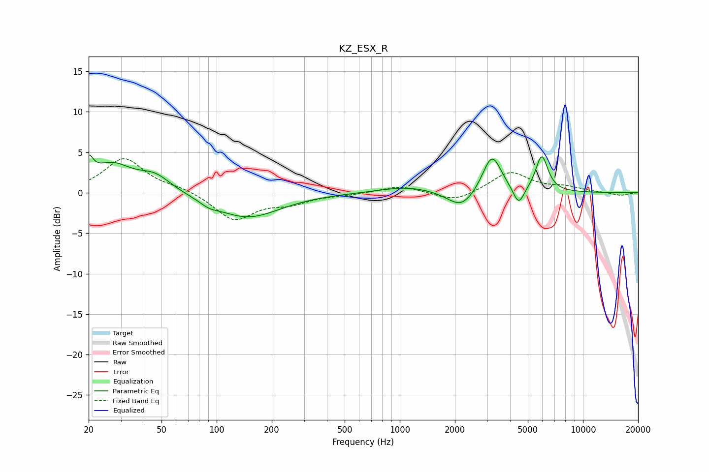

# KZ_ESX_R
See [usage instructions](https://github.com/jaakkopasanen/AutoEq#usage) for more options and info.

### Parametric EQs
Apply preamp of -4.7 dB when using parametric equalizer.

|   # | Type    |   Fc (Hz) |    Q |   Gain (dB) |
|-----|---------|-----------|------|-------------|
|   1 | Peaking |        20 | 5.91 |         2.4 |
|   2 | Peaking |        27 | 1.28 |         3.3 |
|   3 | Peaking |        46 | 1.59 |         1.9 |
|   4 | Peaking |        91 | 3.01 |        -0.5 |
|   5 | Peaking |       147 | 0.8  |        -3.1 |
|   6 | Peaking |      1105 | 0.93 |         0.8 |
|   7 | Peaking |      2175 | 1.85 |        -2.3 |
|   8 | Peaking |      3185 | 2.73 |         4.8 |
|   9 | Peaking |      4457 | 4.58 |        -2.3 |
|  10 | Peaking |      5958 | 4.14 |         4.5 |

### Fixed Band EQs
When using fixed band (also called graphic) equalizer, apply preamp of **-4.3 dB** (if available) and set gains manually with these parameters.

|   # | Type    |   Fc (Hz) |    Q |   Gain (dB) |
|-----|---------|-----------|------|-------------|
|   1 | Peaking |        31 | 1.41 |         4.2 |
|   2 | Peaking |        62 | 1.41 |         0.5 |
|   3 | Peaking |       125 | 1.41 |        -3.4 |
|   4 | Peaking |       250 | 1.41 |        -1.1 |
|   5 | Peaking |       500 | 1.41 |        -0.2 |
|   6 | Peaking |      1000 | 1.41 |         0.9 |
|   7 | Peaking |      2000 | 1.41 |        -1.2 |
|   8 | Peaking |      4000 | 1.41 |         2.6 |
|   9 | Peaking |      8000 | 1.41 |         0.6 |
|  10 | Peaking |     16000 | 1.41 |        -0.4 |

### Graphs

