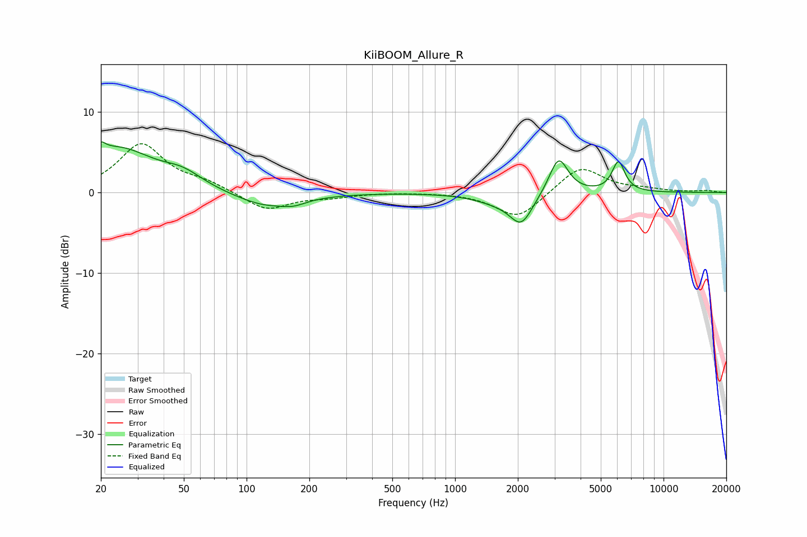

# KiiBOOM_Allure_R
See [usage instructions](https://github.com/jaakkopasanen/AutoEq#usage) for more options and info.

### Parametric EQs
Apply preamp of -6.4 dB when using parametric equalizer.

|   # | Type    |   Fc (Hz) |    Q |   Gain (dB) |
|-----|---------|-----------|------|-------------|
|   1 | Peaking |        20 | 5.99 |         5   |
|   2 | Peaking |        20 | 5.97 |        -3.7 |
|   3 | Peaking |        24 | 0.8  |         5.3 |
|   4 | Peaking |        49 | 1.52 |         1.5 |
|   5 | Peaking |       124 | 0.92 |        -1.9 |
|   6 | Peaking |       169 | 2.63 |        -0.5 |
|   7 | Peaking |      1580 | 1.28 |        -0.9 |
|   8 | Peaking |      2078 | 2.55 |        -3.6 |
|   9 | Peaking |      3138 | 3.1  |         4.7 |
|  10 | Peaking |      6076 | 4.55 |         3.7 |

### Fixed Band EQs
When using fixed band (also called graphic) equalizer, apply preamp of **-6.2 dB** (if available) and set gains manually with these parameters.

|   # | Type    |   Fc (Hz) |    Q |   Gain (dB) |
|-----|---------|-----------|------|-------------|
|   1 | Peaking |        31 | 1.41 |         5.9 |
|   2 | Peaking |        62 | 1.41 |         1   |
|   3 | Peaking |       125 | 1.41 |        -2.3 |
|   4 | Peaking |       250 | 1.41 |        -0.5 |
|   5 | Peaking |       500 | 1.41 |         0.1 |
|   6 | Peaking |      1000 | 1.41 |         0   |
|   7 | Peaking |      2000 | 1.41 |        -3.3 |
|   8 | Peaking |      4000 | 1.41 |         3.3 |
|   9 | Peaking |      8000 | 1.41 |         0.3 |
|  10 | Peaking |     16000 | 1.41 |         0.2 |

### Graphs

