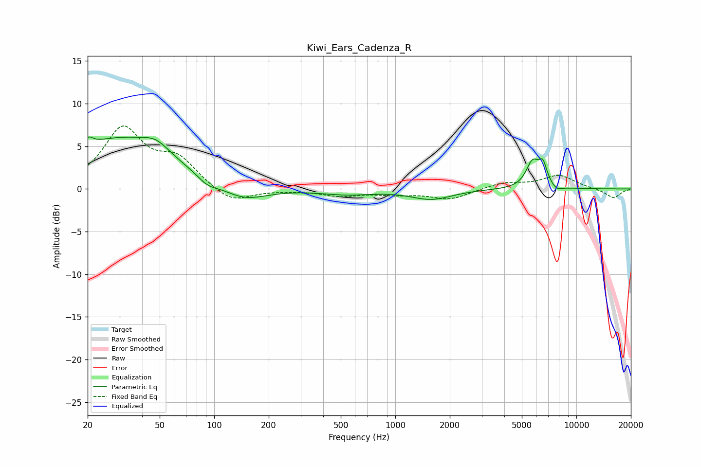

# Kiwi_Ears_Cadenza_R
See [usage instructions](https://github.com/jaakkopasanen/AutoEq#usage) for more options and info.

### Parametric EQs
Apply preamp of -6.2 dB when using parametric equalizer.

|   # | Type    |   Fc (Hz) |    Q |   Gain (dB) |
|-----|---------|-----------|------|-------------|
|   1 | Peaking |        20 | 5.51 |         1   |
|   2 | Peaking |        30 | 0.49 |         5.8 |
|   3 | Peaking |        48 | 1.88 |         1.4 |
|   4 | Peaking |        92 | 2.68 |        -0.9 |
|   5 | Peaking |       145 | 1.11 |        -1.8 |
|   6 | Peaking |       536 | 0.98 |        -0.6 |
|   7 | Peaking |      1585 | 1.26 |        -1.2 |
|   8 | Peaking |      5729 | 3.82 |         3   |
|   9 | Peaking |      6533 | 5.8  |         2.3 |
|  10 | Peaking |      7812 | 4.66 |        -0.5 |

### Fixed Band EQs
When using fixed band (also called graphic) equalizer, apply preamp of **-7.5 dB** (if available) and set gains manually with these parameters.

|   # | Type    |   Fc (Hz) |    Q |   Gain (dB) |
|-----|---------|-----------|------|-------------|
|   1 | Peaking |        31 | 1.41 |         6.9 |
|   2 | Peaking |        62 | 1.41 |         3.2 |
|   3 | Peaking |       125 | 1.41 |        -1.8 |
|   4 | Peaking |       250 | 1.41 |        -0.1 |
|   5 | Peaking |       500 | 1.41 |        -0.7 |
|   6 | Peaking |      1000 | 1.41 |        -0.5 |
|   7 | Peaking |      2000 | 1.41 |        -1.2 |
|   8 | Peaking |      4000 | 1.41 |         0.7 |
|   9 | Peaking |      8000 | 1.41 |         1.6 |
|  10 | Peaking |     16000 | 1.41 |        -1.1 |

### Graphs

