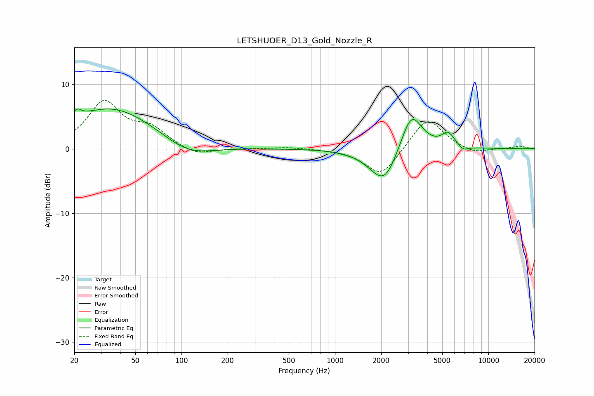

# LETSHUOER_D13_Gold_Nozzle_R
See [usage instructions](https://github.com/jaakkopasanen/AutoEq#usage) for more options and info.

### Parametric EQs
Apply preamp of -6.3 dB when using parametric equalizer.

|   # | Type    |   Fc (Hz) |    Q |   Gain (dB) |
|-----|---------|-----------|------|-------------|
|   1 | Peaking |        21 | 4.95 |         1.3 |
|   2 | Peaking |        35 | 0.49 |         6.4 |
|   3 | Peaking |       109 | 0.9  |        -2.2 |
|   4 | Peaking |      1845 | 1.42 |        -1.1 |
|   5 | Peaking |      2074 | 1.24 |        -0   |
|   6 | Peaking |      2121 | 1.71 |        -4.7 |
|   7 | Peaking |      2248 | 1.19 |        -0   |
|   8 | Peaking |      3151 | 2.02 |         6.2 |
|   9 | Peaking |      5465 | 3.25 |         2.1 |
|  10 | Peaking |      6876 | 4.01 |        -0.8 |

### Fixed Band EQs
When using fixed band (also called graphic) equalizer, apply preamp of **-7.6 dB** (if available) and set gains manually with these parameters.

|   # | Type    |   Fc (Hz) |    Q |   Gain (dB) |
|-----|---------|-----------|------|-------------|
|   1 | Peaking |        31 | 1.41 |         7   |
|   2 | Peaking |        62 | 1.41 |         2.8 |
|   3 | Peaking |       125 | 1.41 |        -1.2 |
|   4 | Peaking |       250 | 1.41 |         0   |
|   5 | Peaking |       500 | 1.41 |         0.3 |
|   6 | Peaking |      1000 | 1.41 |        -0.1 |
|   7 | Peaking |      2000 | 1.41 |        -4.4 |
|   8 | Peaking |      4000 | 1.41 |         5.1 |
|   9 | Peaking |      8000 | 1.41 |        -0.9 |
|  10 | Peaking |     16000 | 1.41 |         0.4 |

### Graphs

